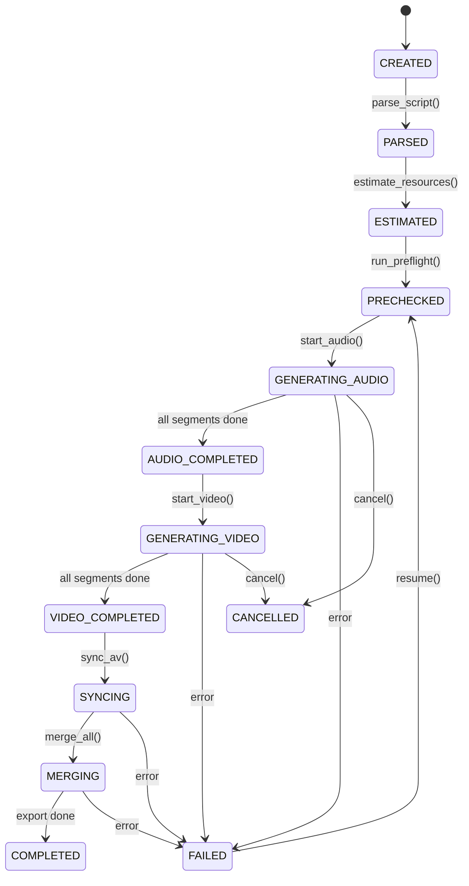

# WorkflowVdAi — Script-to-Video Production Pipeline

A local-first application that converts structured scripts into finished video with audio, using AI providers for TTS and video generation, with full quota management, error recovery, and provider abstraction.

---

## 1. Product Overview

### What It Does
Takes a structured script (numbered segments) and produces a final video by:
1. Parsing the script into segments
2. Estimating resource requirements
3. Checking provider quotas
4. Generating audio per segment (TTS)
5. Optionally generating video per segment (Text-to-Video)
6. Synchronizing audio + video timing
7. Merging all segments into a final MP4

### Core Principles
- **Local-first**: All media stored on user's machine
- **Provider-independent**: Swap AI providers without touching workflow logic
- **Quota-aware**: Never start work that can't be completed
- **Recoverable**: Resume after crashes without losing completed work
- **Simple**: No over-engineering; SQLite, no Redis/Celery

---

## 2. Architecture Review

### Existing Codebase
The workspace `c:\Hack\WorkflowVdAi` is **empty** — this is a greenfield project. No existing code, dependencies, or framework constraints to work around.

### Recommended Architecture

```
┌──────────────────────────────────────────────┐
│                   Frontend                    │
│              React + Vite (SPA)               │
│                                               │
│  Dashboard │ Project │ Generate │ Logs │ Settings
└────────────────────┬─────────────────────────┘
                     │ HTTP/REST + SSE
┌────────────────────┴─────────────────────────┐
│                   Backend                     │
│               FastAPI (Python)                │
│                                               │
│  ┌─────────────┐  ┌──────────────────────┐   │
│  │  REST API    │  │ WorkflowOrchestrator │   │
│  │  Controllers │  │   (State Machine)    │   │
│  └──────┬──────┘  └──────────┬───────────┘   │
│         │                    │                │
│  ┌──────┴──────┐  ┌─────────┴────────────┐   │
│  │  Services   │  │  Background Workers  │   │
│  │  (Business  │  │  (asyncio tasks)     │   │
│  │   Logic)    │  │                      │   │
│  └──────┬──────┘  └──────────┬───────────┘   │
│         │                    │                │
│  ┌──────┴────────────────────┴───────────┐   │
│  │         Provider Abstraction          │   │
│  │  ┌───────┐ ┌───────┐ ┌────────────┐  │   │
│  │  │ Audio │ │ Video │ │    LLM     │  │   │
│  │  │Provdr │ │Provdr │ │  Provider  │  │   │
│  │  └───────┘ └───────┘ └────────────┘  │   │
│  └───────────────────────────────────────┘   │
│                                               │
│  ┌────────────┐  ┌───────────┐  ┌─────────┐  │
│  │ QuotaMgr   │  │ FFmpeg    │  │ SQLite  │  │
│  │ Estimator  │  │ Processor │  │   DB    │  │
│  └────────────┘  └───────────┘  └─────────┘  │
└──────────────────────────────────────────────┘
```

---

## 3. Technology Stack

| Layer | Technology | Justification |
|:------|:-----------|:--------------|
| **Language** | Python 3.11+ | Mature AI/ML ecosystem, async support |
| **Backend Framework** | FastAPI | Async-native, Pydantic integration, auto OpenAPI docs |
| **Data Validation** | Pydantic v2 | Type-safe models, serialization |
| **Database** | SQLite (via aiosqlite) | Local-first, zero-config, sufficient for single-user |
| **ORM** | SQLAlchemy 2.0 (async) | Mature, type-hinted, migration support |
| **Migrations** | Alembic | Standard for SQLAlchemy |
| **HTTP Client** | httpx | Async HTTP, timeout control |
| **Media Processing** | FFmpeg + ffprobe | Industry standard, reliable |
| **Background Tasks** | asyncio (native) | No Redis/Celery needed for single-user |
| **Frontend** | React 18 + Vite | Fast dev server, simple SPA |
| **Frontend HTTP** | Axios | Mature, interceptors |
| **Realtime Updates** | Server-Sent Events (SSE) | Simple, one-way, no WebSocket complexity |
| **Logging** | Python `logging` + structlog | Structured JSON logs |
| **Config** | python-dotenv + Pydantic Settings | Type-safe, `.env` support |
| **Testing** | pytest + pytest-asyncio | Standard Python testing |

---

## 4. AI Provider Research (Verified August 2026)

### A. LLM / Script Processing

| Provider | Free Tier | Quota Type | Rate Limits | API Key Required | Notes |
|:---------|:----------|:-----------|:------------|:-----------------|:------|
| **Gemini Flash** | ✅ Free | Input/Output Tokens | ~10 RPM, ~1,500 RPD, ~250K TPM | Yes (AI Studio) | Data may be used for training on free tier |
| **Gemini Flash-Lite** | ✅ Free | Input/Output Tokens | ~15-30 RPM, ~1,500 RPD | Yes (AI Studio) | Lower quality, higher limits |

> [!NOTE]
> LLM is used only for optional script enhancement/rewriting. The core parse logic does NOT require an LLM.

### B. Text-to-Speech (Audio)

| Provider | Free Tier | Quota Type | Quota Amount | Rate Limits | Quality | Local? | API? |
|:---------|:----------|:-----------|:-------------|:------------|:--------|:-------|:-----|
| **Edge TTS** | ✅ Unlimited free | None (unofficial) | Unlimited | Unknown (practical: high) | High (neural) | No (sends to MS) | No key needed |
| **Kokoro** | ✅ Fully free | None (local) | Unlimited | CPU-bound | High | ✅ Yes | Local only |
| **Chatterbox** | ✅ Fully free | None (local) | Unlimited | GPU-recommended | Excellent | ✅ Yes | Local only |
| **Google Cloud TTS** | ✅ Free tier | Characters/month | 4M (Standard/WaveNet), 1M (Neural2) | 1000 RPM | Excellent | No | Yes, key required |
| **ElevenLabs** | ⚠️ Limited | Characters/month | 10,000 | Unknown | Excellent | No | Yes, key required |
| **OpenAI TTS** | ❌ No free tier | Per 1M characters | N/A | N/A | Excellent | No | Yes, key required |

**Primary Recommendation**: **Edge TTS** (zero-cost, high quality, no API key, 200+ voices, 40+ languages)
**Local Fallback**: **Kokoro** (fully offline, Apache 2.0, 82M params, CPU-friendly)
**Premium Option**: **Google Cloud TTS** (generous free tier, highest quality)

> [!IMPORTANT]
> Edge TTS is an unofficial interface to Microsoft's service. It works reliably but could break if Microsoft changes their backend. Kokoro serves as the local fallback that never breaks.

### C. Text-to-Video

| Provider | Free Tier | Quota Type | Duration Support | API? | Pricing (Paid) | Notes |
|:---------|:----------|:-----------|:-----------------|:-----|:---------------|:------|
| **Kling AI** | ✅ 66 daily credits (web) | Credits/day (resets 24h) | Up to 15 sec | ✅ Official API | ~$0.07-0.10/sec | Daily reset is valuable; API is separate billing |
| **Pika** | ✅ 80 monthly credits | Credits/month | 5-10 sec | ✅ API Club ($10/mo) | ~$0.04-0.09/sec | API requires $10/mo membership |
| **Runway** | ⚠️ 125 one-time credits | One-time credits | 5-10 sec | ✅ Yes | ~$0.05-0.12/sec | Credits don't renew |
| **fal.ai** | ⚠️ Starter credits | Pay-as-you-go | Model dependent | ✅ Yes | ~$0.40/video | Aggregator for open-source models |
| **Replicate** | ⚠️ Try-for-free only | Pay-as-you-go | Model dependent | ✅ Yes | ~$0.07-0.40/sec | Aggregator for open-source models |
| **HunyuanVideo (local)** | ✅ Free (open-source) | None (local) | Unlimited | Local only | Free | Requires 14GB+ VRAM |
| **Google Veo** | ❌ No free API | Pay-as-you-go | Variable | ✅ Vertex AI | ~$0.75/sec | Very expensive |

**Primary Recommendation**: **Kling AI API** (daily reset, reasonable pricing, up to 15 sec native, good quality)
**Budget Option**: **fal.ai** (access to open-source models via API, pay-per-use)
**Local Option**: **HunyuanVideo** (free but requires powerful GPU, 14GB+ VRAM)

> [!WARNING]
> **"API free" vs "Web UI free" distinction**:
> - Kling's 66 daily credits are for the **web app only**, not the API
> - Pika's 80 monthly credits are for the **web app**, API requires $10/mo membership
> - Runway's 125 credits are one-time and non-renewable
> - For true API-level free usage, only local models (HunyuanVideo, LTX-2) qualify

### D. Audio Processing

| Tool | Cost | Local? | Capabilities |
|:-----|:-----|:-------|:-------------|
| **FFmpeg** | ✅ Free | ✅ Yes | Encoding, decoding, conversion, mixing, trimming, concatenation |
| **FFprobe** | ✅ Free | ✅ Yes | Duration measurement, codec info, bitrate detection |
| **pydub** | ✅ Free | ✅ Yes | Python wrapper for audio manipulation (uses FFmpeg) |

**Choice**: FFmpeg/FFprobe directly (subprocess) + pydub for simple operations

### E. Subtitle / Alignment

| Tool | Cost | Local? | Notes |
|:-----|:-----|:-------|:------|
| **Whisper** (OpenAI) | ✅ Free local | ✅ Yes | Word-level timestamp alignment |
| **FFmpeg subtitles** | ✅ Free | ✅ Yes | Burn subtitles into video |
| **pysrt / webvtt-py** | ✅ Free | ✅ Yes | SRT/VTT file manipulation |

> [!NOTE]
> Subtitle generation is a Phase 2+ feature. The core workflow does not require it.

### F. Video Processing

| Tool | Cost | Justification |
|:-----|:-----|:-------------|
| **FFmpeg** | ✅ Free | Concatenation, trimming, padding, looping, re-encoding, muxing |

**Choice**: FFmpeg exclusively. No other video processing library needed.

---

## 5. Quota / Credit Strategy

### Resource Type Taxonomy

The system **must** differentiate between these resource types per provider:

| Resource Type | Unit | Example Providers |
|:-------------|:-----|:-----------------|
| `input_tokens` | tokens | Gemini |
| `output_tokens` | tokens | Gemini |
| `characters` | characters | Google Cloud TTS, ElevenLabs |
| `audio_seconds` | seconds | Kokoro (local, unlimited) |
| `video_credits` | credits | Kling, Pika, Runway |
| `video_seconds` | seconds | fal.ai, Replicate |
| `requests_per_minute` | req/min | All providers |
| `requests_per_day` | req/day | Gemini |
| `monthly_credits` | credits | ElevenLabs |

### QuotaManager Design

```python
class QuotaManager:
    async def get_provider_quota(provider_id) -> ProviderQuota
    async def estimate_usage(project) -> UsageEstimate
    async def can_run(project) -> PreflightResult
    async def record_usage(job) -> None
    async def get_remaining(provider_id) -> QuotaRemaining  # may return "unknown"
```

### Rules
1. If provider has API to check quota → use it
2. If no API → display `Quota: Unknown` or `Quota: Manual configuration`
3. **Never fabricate quota numbers**
4. Track local usage in DB to provide best-effort estimates
5. Block workflow if estimated usage exceeds known remaining quota
6. Allow user override with explicit confirmation when quota is unknown

---

## 6. Workflow State Machine

### Full Workflow (Audio + Video)



### Audio-Only Workflow

```
CREATED → PARSED → ESTIMATED → PRECHECKED → GENERATING_AUDIO → AUDIO_COMPLETED → COMPLETED
```

### Segment-Level States

Each segment independently tracks:
```
PENDING → IN_PROGRESS → COMPLETED
                      → FAILED → RETRYING → COMPLETED
                                           → FAILED (max retries)
```

---

## 7. Database Design

### Entity-Relationship

```mermaid
erDiagram
    projects ||--o{ segments : contains
    projects ||--o{ jobs : has
    projects ||--|| manifests : has
    segments ||--o{ assets : produces
    segments ||--o{ jobs : triggers
    jobs ||--o{ errors : logs
    providers ||--o{ jobs : used_by
    providers ||--o{ usage_snapshots : tracks

    projects {
        text id PK
        text title
        text script_raw
        text workflow_mode
        text workflow_status
        text audio_provider_id
        text video_provider_id
        text voice_id
        text sync_strategy
        text created_at
        text updated_at
    }

    segments {
        int id PK
        text project_id FK
        int segment_number
        text text_content
        int char_count
        text audio_status
        text video_status
        real audio_duration
        real video_duration
        real target_duration
    }

    jobs {
        text id PK
        text project_id FK
        int segment_id FK
        text provider_id FK
        text job_type
        text status
        int retry_count
        text started_at
        text finished_at
        text error_code
        text error_message
    }

    assets {
        text id PK
        int segment_id FK
        text project_id FK
        text asset_type
        text file_path
        text file_format
        int file_size
        real duration
        text created_at
    }

    providers {
        text id PK
        text name
        text provider_type
        text quota_type
        int quota_limit
        int quota_used_local
        bool configured
        text api_key_hash
        text last_verified
    }

    usage_snapshots {
        int id PK
        text provider_id FK
        text resource_type
        real used
        real limit_val
        real remaining
        text snapshot_at
    }

    errors {
        int id PK
        text job_id FK
        text error_type
        int http_status
        text message
        text traceback
        text created_at
    }
}
```

### Table Summary: 7 tables

| Table | Purpose |
|:------|:--------|
| `projects` | Top-level project metadata & workflow state |
| `segments` | Parsed script segments with per-segment status |
| `jobs` | Individual generation jobs (audio/video per segment) |
| `assets` | Generated file references (audio WAV, video MP4, final MP4) |
| `providers` | Configured AI providers with local quota tracking |
| `usage_snapshots` | Point-in-time quota snapshots from provider APIs |
| `errors` | Detailed error logs per job |

---

## 8. Folder Structure

### Project Layout

```
WorkflowVdAi/
├── backend/
│   ├── app/
│   │   ├── __init__.py
│   │   ├── main.py                    # FastAPI app entry
│   │   ├── config.py                  # Pydantic Settings
│   │   ├── database.py                # SQLAlchemy engine + session
│   │   │
│   │   ├── api/                       # REST API layer
│   │   │   ├── __init__.py
│   │   │   ├── routes/
│   │   │   │   ├── projects.py
│   │   │   │   ├── providers.py
│   │   │   │   ├── voices.py
│   │   │   │   └── system.py
│   │   │   └── deps.py                # Dependency injection
│   │   │
│   │   ├── models/                    # SQLAlchemy models
│   │   │   ├── __init__.py
│   │   │   ├── project.py
│   │   │   ├── segment.py
│   │   │   ├── job.py
│   │   │   ├── asset.py
│   │   │   ├── provider.py
│   │   │   ├── usage_snapshot.py
│   │   │   └── error.py
│   │   │
│   │   ├── schemas/                   # Pydantic schemas
│   │   │   ├── __init__.py
│   │   │   ├── project.py
│   │   │   ├── segment.py
│   │   │   ├── provider.py
│   │   │   ├── estimate.py
│   │   │   └── workflow.py
│   │   │
│   │   ├── services/                  # Business logic
│   │   │   ├── __init__.py
│   │   │   ├── script_parser.py
│   │   │   ├── estimator.py
│   │   │   ├── preflight.py
│   │   │   ├── file_manager.py
│   │   │   └── manifest.py
│   │   │
│   │   ├── workflow/                  # Workflow orchestration
│   │   │   ├── __init__.py
│   │   │   ├── orchestrator.py
│   │   │   ├── state_machine.py
│   │   │   ├── sync_engine.py
│   │   │   └── merge_engine.py
│   │   │
│   │   ├── providers/                 # Provider abstraction
│   │   │   ├── __init__.py
│   │   │   ├── base.py               # ABC interfaces
│   │   │   ├── registry.py           # Provider registry
│   │   │   ├── audio/
│   │   │   │   ├── __init__.py
│   │   │   │   ├── base.py
│   │   │   │   ├── edge_tts.py
│   │   │   │   ├── kokoro.py
│   │   │   │   └── google_cloud_tts.py
│   │   │   ├── video/
│   │   │   │   ├── __init__.py
│   │   │   │   ├── base.py
│   │   │   │   ├── kling.py
│   │   │   │   └── fal_ai.py
│   │   │   └── llm/
│   │   │       ├── __init__.py
│   │   │       ├── base.py
│   │   │       └── gemini.py
│   │   │
│   │   ├── usage/                     # Quota & estimation
│   │   │   ├── __init__.py
│   │   │   ├── estimator.py
│   │   │   ├── quota_manager.py
│   │   │   ├── resource_types.py
│   │   │   └── models.py
│   │   │
│   │   ├── media/                     # FFmpeg wrapper
│   │   │   ├── __init__.py
│   │   │   ├── ffmpeg.py
│   │   │   ├── ffprobe.py
│   │   │   └── strategies.py          # sync strategies
│   │   │
│   │   └── core/                      # Cross-cutting
│   │       ├── __init__.py
│   │       ├── logging.py
│   │       ├── retry.py
│   │       ├── exceptions.py
│   │       └── security.py
│   │
│   ├── alembic/                       # DB migrations
│   ├── tests/
│   │   ├── unit/
│   │   ├── integration/
│   │   └── e2e/
│   ├── alembic.ini
│   ├── requirements.txt
│   └── pyproject.toml
│
├── frontend/
│   ├── src/
│   │   ├── components/
│   │   ├── pages/
│   │   ├── services/
│   │   ├── hooks/
│   │   ├── App.jsx
│   │   └── main.jsx
│   ├── public/
│   ├── package.json
│   └── vite.config.js
│
├── data/                              # LOCAL media storage
│   └── projects/
│       └── <project_id>/
│           ├── script/
│           ├── audio/
│           │   ├── segment_001/
│           │   └── ...
│           ├── video/
│           │   ├── segment_001/
│           │   └── ...
│           ├── tmp/
│           ├── output/
│           ├── logs/
│           └── manifest.json
│
├── .env.example
├── .gitignore
├── PLAN.md
├── PROCESS.md
└── README.md
```

---

## 9. API Design

### Core Endpoints

| Method | Endpoint | Purpose |
|:-------|:---------|:--------|
| `POST` | `/api/projects` | Create project with script |
| `GET` | `/api/projects` | List all projects |
| `GET` | `/api/projects/{id}` | Get project details |
| `DELETE` | `/api/projects/{id}` | Delete project |
| `POST` | `/api/projects/{id}/parse` | Parse script into segments |
| `POST` | `/api/projects/{id}/estimate` | Estimate resource requirements |
| `POST` | `/api/projects/{id}/precheck` | Run preflight checks |
| `POST` | `/api/projects/{id}/run` | Start generation workflow |
| `POST` | `/api/projects/{id}/resume` | Resume failed workflow |
| `POST` | `/api/projects/{id}/cancel` | Cancel running workflow |
| `GET` | `/api/projects/{id}/status` | Get workflow status (SSE) |
| `GET` | `/api/projects/{id}/logs` | Get project logs |
| `POST` | `/api/projects/{id}/segments/{n}/regenerate` | Regenerate specific segment |

### Provider Endpoints

| Method | Endpoint | Purpose |
|:-------|:---------|:--------|
| `GET` | `/api/providers` | List all providers (grouped by type) |
| `GET` | `/api/providers/{id}` | Get provider details + quota |
| `POST` | `/api/providers/{id}/configure` | Set API key |
| `POST` | `/api/providers/{id}/verify` | Verify API key + connectivity |
| `GET` | `/api/providers/{id}/voices` | List available voices |

### System Endpoints

| Method | Endpoint | Purpose |
|:-------|:---------|:--------|
| `GET` | `/api/system/health` | Health check (FFmpeg, DB, disk) |
| `GET` | `/api/system/interrupted` | List interrupted projects |
| `POST` | `/api/system/cleanup` | Clean temp files |

### Response Format

```json
{
  "success": true,
  "data": { ... },
  "error": null
}
```

Error responses:
```json
{
  "success": false,
  "data": null,
  "error": {
    "code": "QUOTA_EXCEEDED",
    "message": "Not enough video credits",
    "details": { ... }
  }
}
```

---

## 10. Preflight Check System

Before any generation starts, the following checks run:

| # | Check | Required | Error if Failed |
|:--|:------|:---------|:----------------|
| 1 | Script is valid & parsed | ✅ | `INVALID_SCRIPT` |
| 2 | Segment count > 0 | ✅ | `EMPTY_SCRIPT` |
| 3 | Audio provider configured | ✅ | `PROVIDER_NOT_CONFIGURED` |
| 4 | Audio provider API key valid | ✅ | `INVALID_API_KEY` |
| 5 | Audio provider reachable | ✅ | `PROVIDER_UNREACHABLE` |
| 6 | Audio quota sufficient | ✅ | `QUOTA_INSUFFICIENT` |
| 7 | Voice selection valid | ✅ | `INVALID_VOICE` |
| 8 | Video provider configured (if mode=video) | Conditional | `PROVIDER_NOT_CONFIGURED` |
| 9 | Video provider API key valid (if mode=video) | Conditional | `INVALID_API_KEY` |
| 10 | Video quota sufficient (if mode=video) | Conditional | `QUOTA_INSUFFICIENT` |
| 11 | FFmpeg installed | ✅ | `FFMPEG_NOT_FOUND` |
| 12 | Output directory writable | ✅ | `STORAGE_NOT_WRITABLE` |
| 13 | Sufficient disk space (estimated) | ✅ | `INSUFFICIENT_DISK_SPACE` |
| 14 | Internet available (if cloud provider) | Conditional | `NO_INTERNET` |

**If any required check fails → STOP. Do not proceed.**

---

## 11. Audio/Video Synchronization Strategy

### Configurable Strategies

```python
class SyncStrategy(str, Enum):
    TRIM_VIDEO = "trim_video"         # Trim video to match audio duration
    LOOP_VIDEO = "loop_video"         # Loop video to match audio duration
    PAD_VIDEO = "pad_video"           # Add black frames to extend video
    SPEED_VIDEO = "speed_video"       # Speed up/slow down video
    TRIM_AUDIO = "trim_audio"         # Trim audio (rarely desired)
```

### Default Strategy

```
If audio < video → TRIM_VIDEO (cut video to audio length)
If audio > video → LOOP_VIDEO (loop video to fill audio length)
If audio ≈ video (±0.5s) → no adjustment
```

### Per-Segment Sync Record

```json
{
  "segment": 3,
  "audio_duration": 5.23,
  "video_duration": 8.00,
  "sync_strategy": "trim_video",
  "target_duration": 5.23,
  "adjustment_seconds": -2.77
}
```

---

## 12. Retry Strategy

### Error Classification & Actions

| HTTP Status / Error | Classification | Action | Max Retries |
|:--------------------|:---------------|:-------|:------------|
| `429` | Rate limit | Retry with exponential backoff | 5 |
| `500-503` | Server error | Retry with backoff | 3 |
| Timeout | Network issue | Retry with backoff | 3 |
| Network error | Connectivity | Retry with backoff | 3 |
| `401/403` | Auth failure | **STOP** — invalid API key | 0 |
| `400` | Bad request | **STOP** — fix input | 0 |
| Quota exhausted | Resource limit | **STOP** — notify user | 0 |
| Content policy | Rejection | Mark segment FAILED, continue others | 0 |

### Backoff Configuration

```python
RETRY_CONFIG = {
    "max_retries": 3,
    "initial_delay": 2.0,      # seconds
    "max_delay": 60.0,          # seconds
    "backoff_factor": 2.0,      # exponential
    "jitter": True,             # random jitter to avoid thundering herd
}
```

---

## 13. Error Handling & Recovery

### Recovery Flow

```
App starts
    ↓
Check DB for projects with status in:
  [GENERATING_AUDIO, GENERATING_VIDEO, SYNCING, MERGING]
    ↓
For each interrupted project:
  - Read manifest.json
  - Cross-reference with actual files on disk
  - Determine which segments completed (files exist + DB status)
  - Mark project as INTERRUPTED
    ↓
Display to user:
  "Project 'Demo' was interrupted. Resume / Restart / Delete"
    ↓
If Resume:
  - Run preflight again
  - Skip completed segments (idempotency)
  - Resume from first incomplete segment
```

### Idempotency Rules

1. Check segment status in DB before processing
2. If segment has status `COMPLETED` and asset file exists on disk → **skip**
3. If segment has status `COMPLETED` but file is missing → mark as `PENDING`, reprocess
4. If segment has status `FAILED` → reprocess
5. Never regenerate completed segments unless user explicitly clicks "Regenerate"

---

## 14. Manifest Design

Each project maintains a `manifest.json`:

```json
{
  "version": "1.0",
  "project_id": "proj_abc123",
  "title": "My Video Project",
  "created_at": "2026-08-21T12:00:00Z",
  "updated_at": "2026-08-21T12:30:00Z",
  "workflow_mode": "audio_video",
  "workflow_status": "GENERATING_VIDEO",
  "sync_strategy": "trim_video",
  "audio_provider": "edge_tts",
  "video_provider": "kling",
  "voice": {
    "id": "en-US-AriaNeural",
    "name": "Aria",
    "language": "en-US"
  },
  "segments": [
    {
      "number": 1,
      "text": "Hello everyone...",
      "char_count": 42,
      "audio_status": "completed",
      "video_status": "completed",
      "audio_file": "audio/segment_001/segment_001_audio.wav",
      "video_file": "video/segment_001/segment_001_video.mp4",
      "audio_duration": 5.23,
      "video_duration": 8.0,
      "target_duration": 5.23,
      "merged_file": "output/segment_001_final.mp4"
    }
  ],
  "usage_estimate": {
    "total_characters": 18430,
    "total_segments": 24,
    "estimated_audio_duration": 137.0,
    "estimated_video_clips": 24,
    "estimated_video_seconds": 192
  },
  "usage_actual": {
    "audio_characters_used": 12500,
    "video_credits_used": 15,
    "total_audio_duration": 89.3
  },
  "output": {
    "final_file": "output/final_video.mp4",
    "duration": 137.0,
    "resolution": "1080p",
    "format": "mp4"
  }
}
```

---

## 15. UI Structure

### Pages

| Page | Route | Purpose |
|:-----|:------|:--------|
| Dashboard | `/` | List projects, create new, show interrupted |
| Create Project | `/projects/new` | Script input + parse + estimate |
| Project Detail | `/projects/:id` | Provider/voice selection, precheck, generate |
| Generate View | `/projects/:id/generate` | Real-time progress with SSE |
| Settings | `/settings` | Provider configuration, API keys |
| Logs | `/projects/:id/logs` | View structured logs |

### Key UI Components

1. **Script Input**: Textarea with real-time segment counter
2. **Estimate Display**: Breakdown by provider, resource type, and availability
3. **Provider Cards**: Show quota status with clear ✅/❌ indicators
4. **Voice Selector**: Dropdown with preview button (if provider supports)
5. **Mode Toggle**: Radio buttons for "Audio Only" / "Audio + Video"
6. **Progress View**: Overall + per-segment progress bars with SSE updates
7. **Interrupted Projects Banner**: Shows on dashboard if unfinished projects exist

---

## 16. Security

| Concern | Mitigation |
|:--------|:-----------|
| API keys in git | `.gitignore` includes `.env`, `.env.local` |
| API key exposure to frontend | Backend-only provider calls; frontend sees `Configured ✅` |
| Path traversal | Validate and sanitize all file paths, use `pathlib.Path.resolve()` |
| FFmpeg injection | Use `subprocess.run()` with list arguments, never string interpolation |
| File size limits | Configurable max script size |
| Filename sanitization | Deterministic naming (`segment_NNN_type.ext`), no user-supplied filenames |

---

## 17. Configuration

All configurable values in a single `config.py`:

```python
class Settings(BaseSettings):
    # Paths
    DATA_DIR: Path = Path("data")
    DB_PATH: Path = Path("data/workflow.db")

    # Video
    VIDEO_TARGET_DURATION: int = 8              # seconds
    VIDEO_OUTPUT_RESOLUTION: str = "1080p"
    VIDEO_FORMAT: str = "mp4"

    # Audio
    AUDIO_FORMAT: str = "wav"
    AUDIO_SAMPLE_RATE: int = 24000

    # Workflow
    MAX_CONCURRENCY: int = 2
    MAX_RETRIES: int = 3
    RETRY_INITIAL_DELAY: float = 2.0
    RETRY_MAX_DELAY: float = 60.0
    RETRY_BACKOFF_FACTOR: float = 2.0

    # Sync
    DEFAULT_SYNC_STRATEGY: str = "trim_video"
    SYNC_TOLERANCE_SECONDS: float = 0.5

    # Provider API Keys (from .env)
    GEMINI_API_KEY: str = ""
    GOOGLE_CLOUD_TTS_API_KEY: str = ""
    ELEVENLABS_API_KEY: str = ""
    KLING_API_KEY: str = ""
    FAL_API_KEY: str = ""
```

---

## 18. Testing Strategy

### Unit Tests

| Module | What to Test |
|:-------|:-------------|
| `script_parser` | Parse valid/invalid scripts, edge cases (empty, 1 segment, Unicode) |
| `estimator` | Character counting, duration estimation, resource calculation |
| `quota_manager` | Quota comparison logic, unknown quota handling |
| `sync_engine` | All sync strategies, edge durations |
| `file_manager` | Path construction, sanitization, cleanup |
| `manifest` | JSON serialization/deserialization, state reconstruction |
| `retry` | Backoff calculation, error classification, max retry enforcement |
| `state_machine` | Valid/invalid transitions, terminal states |

### Integration Tests

| Area | What to Test |
|:-----|:-------------|
| Provider connectivity | API key validation, error responses |
| Audio generation | Small segment → WAV file created |
| Video generation | Small prompt → MP4 file created |
| FFmpeg | Trim, loop, concat, probe duration |
| Database | CRUD operations, concurrent access |

### Recovery Tests

| Scenario | Expected Behavior |
|:---------|:-----------------|
| Crash at segment 3 of 5 | Resume processes only segments 3-5 |
| Network drops mid-request | Retry with backoff |
| Provider returns 429 | Retry with exponential backoff |
| Provider returns 500 | Retry up to max |
| Quota exhausted | Stop workflow, notify user |
| Invalid API key | Stop immediately |
| FFmpeg missing | Preflight catches it |
| Disk full | Preflight estimates disk needs |

---

## 19. Implementation Phases

| Phase | Scope | Deliverable |
|:------|:------|:-----------|
| **1** | Project setup | Repo structure, config, .env, .gitignore, dependencies |
| **2** | Database + Models | SQLAlchemy models, Alembic migrations, SQLite setup |
| **3** | Script Parser | Parse structured scripts into segments |
| **4** | Provider Abstraction | Base interfaces, registry, Edge TTS implementation |
| **5** | Estimator + Quota Manager | Resource estimation, quota checking |
| **6** | Preflight System | All preflight checks |
| **7** | Audio Generation | Edge TTS provider, audio workflow, FFprobe duration |
| **8** | Workflow Engine | State machine, orchestrator, background workers |
| **9** | Video Generation | Kling/fal.ai provider, video workflow |
| **10** | Sync + Merge | FFmpeg sync strategies, segment merge, final export |
| **11** | Recovery + Resume | Crash detection, manifest-based recovery |
| **12** | Frontend | React SPA, all pages, SSE progress |
| **13** | Testing | Unit + Integration + Recovery tests |
| **14** | Polish + Optimization | Concurrency tuning, error UX, logging review |

---

## 20. Risks and Mitigations

| Risk | Impact | Likelihood | Mitigation |
|:-----|:-------|:-----------|:-----------|
| Edge TTS breaks (MS changes backend) | Audio generation fails | Medium | Kokoro local fallback ready; provider abstraction allows instant swap |
| Video provider API costs spike | Budget exceeded | Medium | Support multiple video providers; local model option |
| Video provider generates wrong duration | A/V sync issues | High | Sync engine with trim/loop/pad strategies |
| FFmpeg not installed on user machine | Cannot process media | Low | Preflight check catches it; clear installation instructions |
| SQLite concurrent write issues | Data corruption | Low | Single-writer model; WAL mode; proper async locking |
| Large scripts (100+ segments) | Memory/time issues | Medium | Streaming processing; configurable concurrency |
| Provider rate limits during batch | Workflow stalls | High | Semaphore-controlled concurrency; backoff; RPM awareness |

---

## User Review Required

> [!IMPORTANT]
> **Provider Selection**: The plan recommends **Edge TTS** (free, no API key) as primary audio and **Kling AI API** (paid per-use) as primary video. Please confirm:
> 1. Are you comfortable with Edge TTS as the default audio provider?
> 2. Do you have or plan to get a Kling AI API key, or should we prioritize fal.ai or local models (HunyuanVideo)?
> 3. Do you need Gemini LLM integration for script enhancement in Phase 1, or is it a later feature?

> [!IMPORTANT]
> **Frontend Framework**: The plan uses React + Vite (simple SPA). Since the workspace is empty, there's no existing framework constraint. Please confirm this is acceptable.

> [!WARNING]
> **Video Generation Costs**: No truly free video generation API exists for programmatic use. Options are:
> - **Kling AI API**: ~$0.07-0.10/sec (a 24-segment project ≈ $13-19)
> - **fal.ai**: ~$0.40/video (a 24-segment project ≈ $9.60)
> - **Local HunyuanVideo**: Free but requires 14GB+ VRAM GPU
> - Should we implement a "placeholder video" mode for development that uses static images instead?

## Open Questions

> [!IMPORTANT]
> 1. **Script Format**: The spec shows `Phân đoạn 1: ...` — should the parser also support `Segment 1: ...`, numbered lists (`1. ...`), or other formats?
> 2. **Video Content**: When generating video from text, should the prompt be the segment text itself, or should an LLM generate a visual description from the text?
> 3. **Output Resolution**: Default 1080p? Or should this be user-configurable per project?
> 4. **Language Priority**: Is the primary use case Vietnamese or English scripts? This affects TTS voice defaults.
> 5. **Concurrency Preference**: Default `MAX_CONCURRENCY=2` for API calls — is this conservative enough for your network/API tier?
