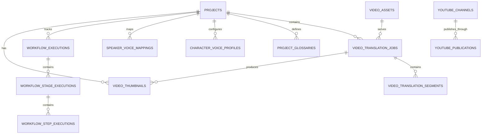

# AutoTransAI (WorkflowVdAi) — Project Knowledge Base

> **Single Source of Truth (SSOT)**: This document represents the authoritative, empirically verified ground truth of the AutoTransAI codebase as of September 2026. All agents and developers must consult this document before modifying the project and update it whenever architectural, database, API, or workflow changes occur.

---

## 1. Project Overview

**AutoTransAI** (internal package identifier: `WorkflowVdAi`) is a production-grade, local-first AI Video Translation, Dubbing, Editing, and Social Publishing platform. It provides an automated end-to-end pipeline that transforms foreign-language videos (YouTube, Bilibili, TikTok, direct video files, or raw video URLs) into fully localized, studio-quality videos with synchronized natural AI dubbing, burned-in subtitles, watermarks, AI-generated thumbnails, and automated multi-platform publishing (YouTube and TikTok).

### Key Product Capabilities
1. **Multi-Source Video Ingestion**: Secure URL downloads (YouTube, Bilibili with DASH/Range resume, TikTok, Google Drive, Vimeo, direct MP4/MKV) and direct browser file uploads with SSRF validation, automatic dead-zone filler trimming, and automated copyright heuristics.
2. **Speech-to-Text & Diarization**: Gemini API STT with resilient multi-stage fallback parsing, language detection, and speaker diarization to separate multi-character dialogue.
3. **Glossary-Enforced Translation**: 1:1 bi-directional terminology glossary with SHA-256 canonical hashing, self-mapped CJK sanitization, and automated targeted LLM retry on glossary violations.
4. **Multimodal Visual Gender Detection**: 4-frame representative sampling (0%, 25%, 75%, 100% of speech timeline) combined into an optimized 1024x576 2x2 contact sheet via FFmpeg, queried via VisionProvider abstraction in a single API call immediately after STT and before Character Mapping and Translation.
5. **Dynamic Character Voice Dubbing**: Character-centric voice allocation across Edge-TTS, Google Cloud TTS, and ElevenLabs with bounded timeline scheduling, atempo time-stretching, same-voice overlap serialization, and ducking.
6. **Post-Production & Branding**: Subtitle generation (ASS/SRT/VTT), watermark logo/text overlay, background music ducking, and FFmpeg video multiplexing.
7. **AI Thumbnail Generation**: Keyless visual asset creation via Pollinations AI (with Fal.ai / OpenAI DALL-E candidate options) analyzed from video transcription themes.
8. **Social Publishing**: Resumable Google YouTube API v3 OAuth 2.0 uploads and TikTok Content Posting API OAuth 2.0 with desktop PKCE.
9. **Standalone Video Merger**: Decoupled, dedicated FFmpeg video concatenation suite supporting stream-copy and complex-filter aspect ratio/resolution normalization.

---

## 2. Architecture

AutoTransAI uses a **Local-First Client-Server Architecture** designed for standalone desktop operation with zero external cloud database dependencies.

```text
┌────────────────────────────────────────────────────────────────────────┐
│                        Native Desktop Wrapper                          │
│        (AutoTransAi.lnk -> AutoTransAi.vbs -> app_launcher.py)         │
│                 pywebview Window (AppUserModelID)                      │
└──────────────────┬──────────────────────────────────┬──────────────────┘
                   │                                  │
                   ▼ (HTTP / SSE :5173)               ▼ (REST / SSE :8000)
┌───────────────────────────────────────┐  ┌─────────────────────────────┐
│          React 18 Frontend            │  │      FastAPI Backend        │
│          (Vite Dev Server)            │  │      (Python 3.12)          │
│  - Studio (VideoTranslator.jsx)       │  │  - Lifespan & Providers Reg │
│  - Ghép Video (VideoMerger.jsx)       │  │  - 6-Stage Workflow Engine  │
│  - Dự án (Dashboard.jsx)              │  │  - AIModelResolver (SSOT)   │
│  - Chi tiết (ProjectDetail.jsx)       │  │  - KeyManager (api_keys)    │
│  - Cài đặt (Settings.jsx)             │  │  - FFmpeg / FFprobe Media   │
└───────────────────────────────────────┘  └──────────────┬──────────────┘
                                                          │
                   ┌──────────────────────────────────────┴──────────────┐
                   ▼                                                     ▼
┌───────────────────────────────────────┐  ┌─────────────────────────────┐
│            Database Layer             │  │     Local Disk Storage      │
│  Configured DATABASE_URL or local     │  │  Root: ./storage/ (SSOT)    │
│  SQLite in DATA_DIR by default        │  │  - projects/<id>/           │
│  No automatic DB fallback             │  │  - translator/jobs/<id>/    │
│  (startup fails on configured error)  │  │  - translator/assets/<id>/  │
│  0% Supabase / Cloud DB dependency    │  │  - merger/jobs/<id>/        │
└───────────────────────────────────────┘  └─────────────────────────────┘
```

### Architectural Pillars
- **Single Source of Truth AI Model Routing (`AIModelResolver`)**: Pipeline stages never hardcode model identifiers. Models are resolved dynamically from database tables (`ai_function_configs` -> `ai_models`).
- **Two-Phase Translation Pipeline**:
  - **Phase 1 (STT & Translation)**: Ingest, Audio Extraction, STT, Diarization, Terminology & Glossary, LLM Translation, Verbatim Echo Detection & Targeted Recovery.
  - **Phase 2 (TTS & Production)**: Voice assignment & Character Review, Post-TTS Scheduling, Audio Normalization, FFmpeg Video Muxing, Subtitle/Watermark burning, AI Thumbnail.
- **Failover & Resiliency**: Configured database startup errors are explicit; canonical key routing records result/cooldown state in the database, while historical provider paths retain `KeyManager`; dual confirmation gates (`auto_confirm_translation`, `auto_confirm_voice`) remain.
- **Memory Safety & Streaming**: Heavy binary ingest pipelines (like video generation and external downloads) rely strictly on chunked async byte streaming (`httpx.AsyncClient.stream`) instead of in-memory buffering to prevent Out-Of-Memory (OOM) crashes on large multi-gigabyte video files.
- **Clean Subprocess Handling**: Windows ProactorEventLoopPolicy initialized on startup; explicit process tree termination on window close.

---

## 3. Directory Structure

```text
C:\Hack\AutoTransAI\
├── AGENTS.md                          # Mandatory agent operational rules & protocol
├── CHANGELOG_AI.md                    # Machine-maintained engineering activity log
├── PROJECT_KNOWLEDGE_BASE.md          # Single Source of Truth architecture document
├── app_launcher.py                    # Windows native desktop window & process orchestrator
├── app_launcher.ps1                   # PowerShell desktop launch helper
├── AutoTransAi.bat                    # Batch bootstrap launcher
├── AutoTransAi.vbs                    # Silent VBS wrapper (no console window)
├── AutoTransAI Studio.lnk             # Windows desktop shortcut
├── UpdateAppIcon.bat                  # Icon refresh utility script
├── .env                               # Active environment variables (git-ignored)
├── .env.example                       # Environment variable template
│
├── shared/                            # Cross-subsystem shared utilities
│   └── config.py                      # Root directory resolver and .env parser
│
├── backend/                           # FastAPI backend server
│   ├── pyproject.toml                 # Backend project metadata
│   ├── requirements.txt               # Pinned Python package dependencies
│   ├── alembic/                       # Alembic database migrations
│   │   ├── env.py
│   │   ├── script.py.mako
│   │   └── versions/                  # Revision scripts (e.g. glossary single-source)
│   ├── app/
│   │   ├── config.py                  # Pydantic Settings configuration
│   │   ├── database.py                # Async engine, sessionmaker, schema auto-migration
│   │   ├── main.py                    # FastAPI entrypoint, middleware, router mounts
│   │   ├── api/
│   │   │   ├── deps.py                # FastAPI dependency injection (AsyncSession)
│   │   │   ├── routers/               # Specialized sub-routers (youtube.py, tiktok.py)
│   │   │   └── routes/                # Core HTTP routes (projects, video_translator, ...)
│   │   ├── core/                      # Encryption, logging, URL security (SSRF), errors
│   │   ├── media/                     # FFmpeg, FFprobe wrappers & progress parsing
│   │   ├── models/                    # SQLAlchemy 2.0 ORM models (29 tables)
│   │   ├── providers/                 # Audio (TTS), LLM, Video, Image AI provider drivers
│   │   ├── schemas/                   # Pydantic validation schemas & request models
│   │   ├── services/                  # Business logic services (translator, merger, ...)
│   │   ├── usage/                     # Local quota tracking and snapshots
│   │   └── workflow/                  # Unified 6-stage engine, orchestrator, stages
│   └── tests/                         # Unit and integration test suite
│
├── frontend/                          # Vite + React frontend application
│   ├── index.html                     # HTML root template
│   ├── package.json                   # Frontend npm packages
│   ├── vite.config.js                 # Vite dev server and build configuration
│   └── src/
│       ├── main.jsx                   # React root mount with ErrorBoundary
│       ├── App.jsx                    # App shell, URL state synchronization, routing
│       ├── App.css                    # Complete Dark Studio design system
│       ├── api.js                     # Unified Axios REST client and SSE wrapper
│       ├── pages/                     # VideoTranslator, VideoMerger, Dashboard, ...
│       └── components/                # WorkflowTimeline, ProjectGlossaryManager, ...
│
├── data/                              # Persistent local application data
│   ├── api_keys.json                  # Legacy plaintext key pool (migration source)
│   ├── workflow.db                    # Default local SQLite database
│   └── launcher_logs/                 # backend.log, frontend.log from desktop launcher
│
└── storage/                           # Local file storage root (STORAGE_ROOT)
    └── projects/{project_id}/         # Project asset tree (videos, audio, subtitles, ...)
```

---

## 4. Technology Stack

### Backend
- **Runtime**: Python 3.12
- **Web Framework**: FastAPI 0.115+, Starlette, Uvicorn (standard)
- **Data Validation & Settings**: Pydantic v2, Pydantic-Settings
- **ORM & Database**: SQLAlchemy 2.0 (Asyncio), Alembic 1.13+, PyMySQL 1.1+, aiomysql 0.2+, aiosqlite 0.20+
- **HTTP Client**: HTTPX 0.27+
- **Security & Cryptography**: Cryptography 41.0+ (Fernet symmetric token encryption)
- **OAuth & Cloud APIs**: Google API Python Client, google-auth-oauthlib, google-auth-httplib2
- **Audio & Media**: edge-tts 6.1+, FFmpeg (system binary), FFprobe (system binary)
- **Streaming**: sse-starlette 2.0+
- **Logging**: Structlog 24.1+, Standard Python logging

### Frontend
- **Framework**: React 18.3+ (JSX)
- **Build Tool**: Vite 5.4+
- **HTTP Client**: Axios 1.19+
- **Styling**: Vanilla CSS (Custom Design System, Plus Jakarta Sans, CSS Grid/Flexbox)
- **Routing**: URLSearchParams browser-history state synchronization with local storage backup

### Native Desktop Wrapper
- **GUI Host**: pywebview (MSHTML / Edge Chromium WebView2 engine)
- **Windows Integration**: `ctypes.windll.shell32.SetCurrentProcessExplicitAppUserModelID`

---

## 5. Environment & Configuration

Configuration is loaded centrally via `shared.config.load_root_env()` and parsed using Pydantic Settings in `app/config.py`.

| Environment Variable | Type | Default | Description |
|---|---|---|---|
| `DATABASE_URL` | str | empty (local SQLite in `DATA_DIR`) | Explicit database URL; a configured connection failure stops startup without fallback |
| `STORAGE_DRIVER` | str | `local` | Storage driver (`local`) |
| `DATA_DIR` | Path | `./data` | Credential, encryption-key, and default SQLite directory; must resolve outside `STORAGE_ROOT` |
| `STORAGE_ROOT` | Path | `./storage` | Base path for project media files |
| `DEFAULT_LLM_PROVIDER` | str | `gemini` | Default text processing provider |
| `ENABLE_OPENAI_FALLBACK` | bool | `false` | Enable automatic OpenAI fallback |
| `OPENAI_API_KEY` | str | `""` | OpenAI API key |
| `GEMINI_API_KEY` | str | `""` | Google Gemini API key |
| `GOOGLE_CLOUD_TTS_API_KEY` | str | `""` | Google Cloud Neural TTS API key |
| `ELEVENLABS_API_KEY` | str | `""` | ElevenLabs API key |
| `KLING_API_KEY` | str | `""` | Kling AI video generation key |
| `KLING_API_SECRET` | str | `""` | Kling AI video generation secret |
| `FAL_API_KEY` | str | `""` | Fal.ai generation key |
| `ACOUSTID_API_KEY` | str | `""` | AcoustID fingerprinting API key |
| `YOUTUBE_CLIENT_ID` | str | `""` | Google Cloud Console OAuth 2.0 Client ID |
| `YOUTUBE_CLIENT_SECRET` | str | `""` | Google Cloud Console OAuth 2.0 Client Secret |
| `YOUTUBE_REDIRECT_URI` | str | `http://127.0.0.1:8000/api/youtube/oauth-callback` | Google OAuth callback URL |
| `TIKTOK_CLIENT_KEY` | str | `""` | TikTok Developer Client Key |
| `TIKTOK_CLIENT_SECRET` | str | `""` | TikTok Developer Client Secret |
| `TIKTOK_REDIRECT_URI` | str | `http://127.0.0.1:8000/api/tiktok/oauth-callback` | TikTok OAuth callback URL |
| `TIKTOK_SCOPES` | str | `user.info.basic,video.upload,video.publish` | TikTok OAuth requested permissions |
| `ENCRYPTION_KEY` | str | `""` | Secret key used for Fernet token encryption |
| `HOST` | str | `127.0.0.1` | Backend bind address |
| `PORT` | int | `8000` | Backend bind port |
| `DEBUG` | bool | `False` | Debug mode flag |
| `VIDEO_DOWNLOAD_TIMEOUT` | int | `0` | 0 = unlimited wall clock; download handled per byte-flow |

---

## 6. Database

**Explicit legacy data cutover batch (2026-09-24, Task 9):** `legacy_data_cutover.run_legacy_data_cutover(session, json_path=..., env_path=..., master_key=..., dry_run=True)` combines the existing read-only inventory with an advisory default-remap preview. `dry_run=False` requires an explicit caller session and valid master key only when a credential source exists; it imports a single bounded source snapshot as disabled canonical keys, copies archival model identities without activating them, and remaps only safe function defaults. The caller owns commit/rollback. A savepoint rolls back the whole batch on source, provider or catalog conflict; SQLite opens a real outer transaction before the savepoint so caller rollback remains effective. Source files are checked before and after import, and raw keys never appear in result DTOs. This service does not run at startup or connect to a configured database by itself. Review the returned unresolved defaults and import counts before committing an operator-driven cutover.

**Offline backend test isolation (2026-09-24, Task 10):** `backend/tests/conftest.py` redirects default database, data, storage and root dotenv paths to a process-specific temporary directory before app modules are imported, and removes configured credential environment variables, including indexed provider keys. The legacy Settings API tests use their own SQLite database, key JSON file and dotenv file; the auto-confirm integration test uses an isolated database and storage root and mocks its render task. The preflight and audio pipeline integration tests use their own disposable database and storage; audio output is a synthetic Edge TTS WAV. Gemini STT unit tests supply request-local synthetic credentials. No configured database or live provider should be used for plan verification.

**Three-pipeline Settings verification (2026-09-24, Task 10):** `backend/tests/test_three_pipeline_e2e.py` uses one disposable SQLite/API fixture per test and injected discovery to exercise Add Key → canonical Function default selection → actual Studio STT, Unified DUB, and legacy Project video callers. Synthetic adapters assert the exact remote model, request-local credential, voice/media output, and absence of raw keys in API responses or workflow snapshots. Socket connections are blocked. These tests prove the Settings-to-caller wiring without exercising a live provider or configured database.

**Task 9–10 offline verification status (2026-09-24):** An isolated backend run completed with 1,751 passed, 45 skipped and one warning; frontend tests and production build completed with 30 passed. A separate disposable SQLite/MySQL migration and cutover rehearsal completed with 52 passed and one skipped. Actual Alembic `head → 20260923_thumbnail_model_length → head` downgrade/reupgrade passed on empty disposable SQLite and MySQL databases; it does not authorize rollback of populated production data. The three Settings-to-caller tests cover each historical pipeline at its routed AI boundary; they do not render full media outputs end to end. Published revisions and the explicit `legacy_data_cutover` service are ready for operator review on a copied database, but no configured/production database was upgraded, stamped or cut over. The legacy `/api/settings` model/function writers and `/api/providers` JSON-key compatibility paths remain because legacy backend consumers still use `KeyManager` and archival model/function state. Remove those writers and fixed remote seeds only after their remaining consumers are migrated and historical snapshots have been reconciled; a code-only deletion would break compatibility.

**Legacy default shadow comparison (2026-09-24, Task 9 data batch):** Call `remap_legacy_function_defaults(session, dry_run=True)` on an explicit clean database session to preview how many archival function defaults are resolvable, unresolved, already canonical, or conflicting. The preview returns only aggregate counts and fixed issue codes. It rejects pending ORM changes before any read, uses a separate identity map on the caller's connection, and issues nonlocking reads without flushing or writing. The ordinary call remains caller-transactional and locks rows while writing remaps. This is an advisory comparison: under MySQL REPEATABLE READ the preview can use an older snapshot than a later locking remap after another transaction commits. Rerun preview near cutover and inspect the actual remap result before committing.

**MySQL startup canonical catalog replay (2026-09-24, Task 9 schema batch):** The same five catalog/key revisions accept a frozen, exact `SHOW CREATE TABLE` profile from disposable MySQL 8.4 startup ORM tables. The migration-owned validator checks all seven table definitions, names, triggers, and four catalog foreign-key edges for orphan rows before skipping already-present catalog DDL. A populated no-stamp MySQL startup database reaches Alembic head with its catalog rows and DDL unchanged; an altered table or orphan key is rejected before writes, and the blank chain remains valid. Other server versions or default collations may require an independently verified profile; they fail closed. This does not perform production cutover.

**MySQL startup converted glossary replay (2026-09-24, Task 9 schema batch):** The published glossary revision now recognizes an exact converted glossary created by the current MySQL startup ORM without a terminology-memory table or migration backup. It checks stage/audit/backup namespace, triggers and incoming references, validates the converted table/parent, then checks every stored normalized key without writing. The historical MySQL shadow-copy and preserved-backup paths remain distinct. Disposable MySQL tests cover empty, populated and corrupt-key startup rows; full startup `upgrade head` next stops at catalog prerequisites.

**Startup canonical catalog replay (2026-09-24, Task 9 schema batch):** Five published catalog/key revisions use a frozen migration-owned SQLite profile to recognize the current startup ORM's final seven legacy/canonical tables. The profile checks exact table/index DDL fingerprints and object inventory, refuses temporary shadows and foreign-key violations within those seven tables, and otherwise causes those revisions to perform no catalog DDL. A populated disposable no-stamp startup database now reaches Alembic head with its catalog DDL and rows unchanged. Blank-chain migrations still use their historical paths. MySQL startup adoption, explicit production cutover, and full verification are pending.

**Startup converted glossary replay (2026-09-24, Task 9 schema batch):** The current ORM creates `project_glossaries` with normalized keys and omits the removed `project_terminology_memory` table. The published glossary revision now recognizes that exact SQLite state only after validating the parent and complete converted glossary schema, then checks every stored key against frozen normalization without writing. Historical partial children and existing memory tables retain their strict paths. A fresh no-stamp SQLite `upgrade head` now advances past glossary and stops at the legacy catalog prerequisite; MySQL startup replay remains a separate batch.

**Startup publication progress profile (2026-09-24, Task 9 schema batch):** The published `20260908_youtube_progress` revision now accepts the complete later startup-created `youtube_publications` shape with `job_id → jobs.id`, `project_id → projects.id`, and a plain `ix_youtube_publications_project_id`, in addition to the frozen older channel-only profile. It rejects duplicate foreign keys and partial or collated project indexes. The extra job parent identity is checked before any column write. An actual no-stamp Alembic traversal of a disposable SQLite database created by current `Base.metadata.create_all` passes through YouTube progress while preserving an existing publication row. A full startup-schema traversal still stops at the glossary revision because the current ORM creates the converted glossary without the removed terminology-memory table.

**Legacy catalog identity import (2026-09-24, Task 9 data batch):** `legacy_catalog_import.import_legacy_catalog(session)` explicitly copies archival `ai_models` identities into `ai_catalog_models` under the caller's transaction without deleting or rewriting the archive. It refuses missing or collation-equal but byte-different provider/model identities before any insert and returns fixed aggregate counts/codes. Exact existing pairs replay without writes. New rows use `source=legacy_import`, empty capability evidence and no key access; canonical routing, API selectability and caller readiness gates ignore them. A positive provider listing for the exact identity promotes the row to `discovered` and applies the listing's metadata/edge rules. The service is not yet wired to startup or an administrative cutover command; schema adoption, key/default migration sequencing and production cutover remain pending.

**Thumbnail model-width prerequisite (2026-09-24, Task 9D8):** The published `20260923_thumbnail_model_length` revision now owns a frozen `video_thumbnails` definition from Git `08ea050^`. It validates parent IDs, all child columns/defaults/PK/FKs/indexes, and the relation namespace before changing a complete historical `VARCHAR(100)` model to `VARCHAR(255)`. A blank chain creates the full current thumbnail table; a complete current table replays without writes. SQLite historical rebuilds refuse views, triggers and incoming foreign keys before DDL; unknown/partial schema states refuse with fixed backup-reconciliation guidance. The offline SQL path retains the old assumption that the table exists. Actual no-stamp `upgrade head` passed on disposable SQLite and MySQL 8.4, as did a populated MySQL historical widening. Configured databases and production cutover were not used. Other startup-created current schemas and legacy data import remain Task 9 work.

**Frozen legacy catalog prerequisites (2026-09-24, Task 9D7 checkpoint):** The published `20260923_ai_catalog` revision now uses migration-owned `catalog_prerequisites.ensure()` to create or validate `providers`, `ai_function_configs`, and `ai_models` from Git `08ea050^`, including Python-only defaults that do not exist as SQL defaults. All three absent or all three complete historical tables are supported; partial groups, unknown columns/keys/defaults and canonical table/view name collisions fail before online DDL. Compatible populated rows and repeat helper calls are untouched. Offline SQL retains the old assumption that the legacy group already exists; only online execution can inspect and create it when absent. MySQL DDL is not transactional: interruption during the three prerequisite creates can leave a partial group, which intentionally refuses automatic retry until reconciled from a backup. Actual no-stamp Alembic traversal from base through `20260923_catalog_refresh` passed on disposable SQLite and MySQL 8.4. Startup-created current catalog profiles, data import and production cutover remain pending Task 9 work.

**MySQL Alembic version width (2026-09-24, Task 9D6 checkpoint):** Installed Alembic constructs `alembic_version.version_num` as `VARCHAR(32)`, while `20260916_character_voice_timeline` and `20260923_provider_key_requirement` have 33-character IDs. The voice revision is the first such link. After its historical schema preflight and before voice DDL, migration-owned `version_table_width.ensure()` checks the MySQL version table shape, full primary key, and expected predecessor row, then widens `version_num` to `VARCHAR(64)` while preserving collation and the stored row. A complete 64-character profile with the predecessor/current revision replays read-only; unknown widths, non-VARCHAR types, or unknown rows refuse with fixed guidance. Direct revision-operation tests without Alembic's version table continue to work. Disposable MySQL 8.4 verified the widening and an actual no-stamp Alembic traversal from base through voice records the full first long revision ID. This checkpoint does not itself prove full `upgrade head` traversal or production compatibility.

**Historical foreign-key link (2026-09-24, Task 9D5 checkpoint):** The published `20260918_add_fk` revision retains its ID and ancestry but now validates instead of rebuilding tables. The first Alembic link already creates `segments.project_id → projects.id` with `ON DELETE CASCADE`; startup-created `jobs`, `assets`, and `video_edit_configs` likewise already carry their modeled project/job FKs. Those optional tables are checked only when present; `video_edit_configs` requires `jobs`. The obsolete `workflow_engine` table named in the old revision is absent from the historical model and rejected if unexpectedly present. Compatible populated states and replay issue no schema or row writes. Missing/wrong FKs, orphan references (including SQLite databases written with FK enforcement off and MySQL databases written with `FOREIGN_KEY_CHECKS=0`), view shadows, or partial optional dependencies raise a fixed mismatch before any write. Downgrade refuses destructive ownership assumptions. Direct actual-revision tests use isolated SQLite and an opt-in MySQL 8.4 database; full version-table traversal, arbitrary production schemas and cutover remain pending.

**MySQL glossary shadow-copy checkpoint (2026-09-24, Task 9D4B5):** The published glossary revision now uses the frozen prerequisite validator, migration-owned audit, and MySQL collation probe before DDL. It rejects stale stage/backup/audit names, triggers, incoming glossary FKs, incompatible historical schemas, and ambiguous mappings. A staged converted table receives every original glossary row with exact raw text/metadata plus only unique terminology mappings. The original terminology table and rows remain untouched. Before cutover, MySQL table locks protect a second full-row, schema, trigger, and stage check; a single `RENAME TABLE` swaps the stage into place and leaves the complete original glossary as `__alembic_glossary_before_20260916`. A separate `__alembic_glossary_audit_20260916` stores the original row count and SHA-256 digest before the swap, so read-only replay validates backup integrity without comparing it to later active glossary edits. An interrupted attempt leaves reserved objects for explicit backup reconciliation; the migration does not clean them automatically. Fourteen opt-in tests ran against an isolated MySQL 8.4 container, including metadata/schema/trigger changes during copy and backup corruption. The checkpoint does not establish arbitrary production schema compatibility, full Alembic traversal, version-table width, or production cutover readiness.

**MySQL glossary collision probe (2026-09-24, Task 9D4B4 checkpoint):** The migration-owned `glossary_mysql_preflight.collision_codes(connection)` first requires matching MySQL `id` and `project_id` column collations across the two tables, then runs two read-only database comparisons: a cross-table ID join under the destination collation and a project-ID group that compares byte-distinct values within collation-equal groups. It returns only fixed codes. SQLite `NOCASE` regressions and a disposable MySQL 8.4 probe verified case variants, a PAD SPACE trailing-space variant, and fail-closed handling of mixed binary/case-insensitive collations. The probe is deliberately unwired while MySQL conversion remains blocked before SQL; the recovery-safe copy/swap path and full live migration rehearsal are still pending.

**MySQL glossary replay guard (2026-09-24, Task 9D4B3 checkpoint):** Converted-schema validation parses the actual `SHOW CREATE TABLE project_glossaries` unique-key definitions. Both named `(project_id, source_key)` and `(project_id, translation_key)` keys must cover entire columns in ascending order; portable reflection alone omits prefix lengths. Offline tests use SQLAlchemy's MySQL parser for compatible and prefixed definitions. The published revision still blocks MySQL before SQL until collation-aware data preflight and a recovery-safe conversion path are designed and verified.

**Guarded glossary conversion SQLite checkpoint (2026-09-24, Task 9D4B2):** The published `20260916_glossary_single_source` keeps its revision ID and ancestry. It wires the frozen historical glossary prerequisites and migration-owned data audit; neither revision nor helper imports mutable application services. Existing child schemas, data conflicts, SQLite triggers, incoming glossary FKs, target names and Alembic temporary-name collisions are checked before conversion writes. It adds two SHA-256 canonical keys, copies only unique terminology mappings into glossary, preserves original glossary text/metadata and every terminology row/table, and refuses any duplicate mapping that would require row deletion. Imported `approved` follows the inverse of `needs_review`. Conflict errors contain fixed codes without raw terms or identifiers. SQLite uses Alembic's guarded batch table rebuild to make keys non-null and create named 1:1 constraints; no original row is selected for deletion. A complete converted schema and each stored key are validated on read-only replay. Disposable SQLite tests cover these states. MySQL upgrade currently refuses before SQL because historical case-insensitive ID/project collations can bypass the Python audit and MySQL DDL may commit partial changes; MySQL conversion needs collation-aware preflight and full-key validation. Arbitrary production schema, full version traversal, and cutover remain unproven.

**Glossary data audit checkpoint (2026-09-24, Task 9D4B1):** `backend/alembic/glossary_data_audit.py` freezes glossary text cleaning/normalization without importing mutable application services. Its read-only audit selects only memory rows with unique mappings for later copying. Cross-table equivalent mappings require no copy, and all original memory rows remain in place. Conflicting source/translation mappings, duplicate mappings within either table, cross-table ID collisions, and terms invalid after normalization produce fixed codes without raw terms or identifiers. The published glossary revision is not yet wired to this helper; no data, schema, API, or configured database has changed in this checkpoint.

**Frozen glossary prerequisites (2026-09-24, Task 9D4A):** The migration-owned `glossary_prerequisites.ensure(connection)` freezes only the two pre-glossary tables from Git `93200e6^`: `project_glossaries` and `project_terminology_memory`. Both have a `VARCHAR(36)` string PK (BINARY/ascending/ABORT semantics on SQLite), a non-null `VARCHAR(36)` project FK with `ON DELETE CASCADE` and a non-unique project index. The glossary has non-null `source_term`/`translated_term` (`VARCHAR(255)`), `term_type` (`VARCHAR(50)`), `confidence` (`FLOAT`), `approved` (`BOOLEAN`), and `created_at`/`updated_at` (`DATETIME`); `source_context` is nullable `TEXT`. Terminology memory has the same shared fields, `suggested_term` in place of `translated_term`, and non-null `needs_review` (`BOOLEAN`) in place of `approved`. Their ORM defaults and `updated_at` onupdate are Python-only; the frozen tables have no SQL defaults. The parent contract checked here is the existing `projects.id` string PK identity, without owning the rest of `projects`.

`ensure()` preflights the parent and both children before DDL. It creates only when both children are absent; both structurally compatible populated tables and repeated calls remain untouched. Partial/unknown columns, PK/FK/default/index shapes, case/view/global-index collisions and SQLite temporary shadows fail with fixed backup-reconciliation guidance before writes. SQLite validation uses the historical PK guard and full index/collation inventory; MySQL-shaped reflection, including `TINYINT(1)` boolean aliases, and generated DDL are checked offline. No text normalization, merge, row deletion, or published `20260916_glossary_single_source` change occurs here. The helper is deliberately unwired; Task 9D4B must separately decide safe data handling in that published revision. Disposable SQLite and offline MySQL shapes are covered, while full Alembic head traversal, version-table width, live MySQL and production cutover remain unproven.

Task 9D4A review fix: SQLite FK preflight also reads the actual `pragma_foreign_key_list` actions and checks comment-stripped table DDL for deferred constraints, because SQLAlchemy reflection can omit FK options after a comment. MySQL PK preflight parses `SHOW CREATE TABLE` for `projects` and both children, since portable PK reflection hides key-prefix lengths. Populated no-write regressions cover both SQLite post-comment variants; offline real-parser regressions cover a prefixed PK on each table. Equivalent FK comments remain accepted.

**Guarded voice timeline (2026-09-24, Task 9D3B2):** The published `20260916_character_voice_timeline` retains its ID/ancestry and the schema from Git `8ae030a`. It preflights both parent identities, the full four-table voice group, columns/defaults/FKs/PKs/unique constraints/indexes and namespaces before writing. Supported states are both prerequisite children absent, both B1-compatible pre-timeline children, or all four complete post-timeline tables matching the published SQL-default profile or startup's Python-only defaults/non-null timestamps. Mixed/partial profiles, incompatible later objects and SQLite temporary shadows/triggers fail closed before DDL or backfill. B1's `ensure()` remains pre-timeline-only; B2 shares its read-only validation and invokes `ensure()` only after the whole pre-timeline state passes. Creation uses direct additive columns/indexes and the two published tables, never a populated-table rebuild. NULL original timestamps are backfilled from source timestamps; populated originals remain unchanged and replay issues neither schema writes nor redundant updates. Downgrade refuses and directs restoration from a verified backup.

Voice SQL equivalence is deliberately bounded: default numeric 0/1 may be bare/quoted, integer/decimal-zero forms or SQL boolean keywords (including one enclosing expression-parenthesis pair); string defaults must retain their complete exact literal. Default/explicit ABORT PK/unique policies and BINARY/ascending indexes are accepted. Unknown reflection forms fail closed. MySQL `TINYINT(1)` boolean aliases and duplicate unique-index reflection are covered offline using the real SHOW CREATE parser; DDL also compiles offline. Tests run actual revision operations on independent populated/blank SQLite fixtures with enforced FKs and import/network guards. Full version-table traversal, the published 33-character revision width (Task 9D6), glossary/FK/catalog successors, `upgrade head`, live MySQL and arbitrary production schemas remain unproven.

Voice timeline trigger preflight uses case-insensitive target-table comparisons in both `sqlite_master` and `sqlite_temp_master`. SQLite preserves the spelling used by a trigger declaration even though identifier resolution is case-insensitive; lowercase, uppercase and mixed-case permanent/temporary triggers are rejected before any backfill or schema write.

**Frozen voice prerequisites (2026-09-24, Task 9D3B1):** The migration-owned `voice_prerequisites.ensure(connection)` freezes only pre-timeline `speaker_voice_mappings` and `video_translation_segments` from Git `8ae030a^` (`e23f14c`). It validates both tables and the existing `projects.id`/`video_translation_jobs.id` identities before any creation; only both-absent or both-compatible states are supported. Columns, Python-only defaults (no SQL defaults), PK/FK/index semantics, case/view/global-index collisions and SQLite temporary shadows are checked without row writes. Compatible populated tables and repeat calls are unchanged; ambiguous partial states and downgrade ownership fail with fixed reconciliation/backup guidance. SQLite uses the shared historical PK guard plus complete index inventory and column-collation checks. Independent populated SQLite fixtures after direct D1/D2/TikTok operations and offline MySQL DDL compilation are covered. B1 itself left the published revision untouched; B2 above now covers timeline columns, profile/pool tables and backfill. Full-chain/version-table traversal, upgrade-head, live MySQL and production compatibility remain unproven.

Voice prerequisite MySQL preflight also validates reflected `AUTO_INCREMENT`: the frozen translation-segment integer ID must generate omitted values, and other columns must not. Offline tests exercise `ensure()` with SQLAlchemy's real MySQL SHOW CREATE parser for both compatible and missing-AUTO_INCREMENT identity definitions; no live MySQL claim is made.

SQLite D1/D2 PK collation-name comparisons are case-insensitive, matching SQLite semantics even when reflection preserves lowercase or mixed-case `binary`. Exact column identity and ascending-order checks remain unchanged.

**Historical D1/D2 SQLite identity preflight (2026-09-23, Task 9D2X):** A shared migration-owned helper now supplements reflected PK membership in the initial revision and both progress revisions. String IDs require a BINARY ascending primary index and default/explicit ABORT conflict policy; the `id` column's own collation is checked even when a table PK overrides its index collation. `segments.id` must retain the historical integer rowid alias, without AUTOINCREMENT, descending declarations, or WITHOUT ROWID. Non-ABORT constraints and ambiguous identity forms fail with the existing fixed reconciliation error before DDL or row writes. Equivalent column/table PK syntax, explicit BINARY/ASC/ABORT, comments and quoted constraint names remain supported. Both progress groups are still preflighted before either group changes. MySQL retains table-level PK reflection and never calls the SQLite helper. Tests cover actual revision operations on independent populated in-memory fixtures, duplicate-ID cascade-loss probes rolled back in savepoints, compatible rowid allocation and offline MySQL-shaped reflection. No full version-table traversal, live MySQL, arbitrary production schema or upgrade-head claim is made; Task 9D3B and later chain work remain pending.

**Historical TikTok Alembic link (2026-09-23, Task 9D3A):** `20260915_tiktok_accounts` preserves its published ancestry and creates the table/unique `open_id` index from Git `1ebccbb` only when absent. Existing tables must match either the complete published shape or the startup-created shape from the same commit (Python-only defaults and non-null timestamps, still current); validation leaves every value unchanged. Unknown columns/types/nullability/PK/defaults/constraints/indexes, views, case aliases, and SQLite global index-name collisions fail closed before DDL. Downgrade refuses ambiguous ownership and directs restoration from a verified backup; upgrades require an explicit online connection. Isolated actual revision operations now traverse from blank SQLite through TikTok on supported fixtures without stamps. This does not exercise Alembic version-table storage (width remains Task 9D6), `upgrade head`, live MySQL, arbitrary current schemas, or production deployment; MySQL DDL is compiled offline only. Character-voice prerequisites and later chain repairs remain pending.

TikTok SQLite preflight also requires the historical PK's binary collation, ascending order, and default/explicit ABORT conflict policy. It rejects replacement/ignore/fail/rollback policies before writes, while accepting equivalent column/table PK syntax and ignoring conflict-looking text inside comments or quoted names. This prevents accepting a schema where a duplicate account ID could silently replace existing data.

**Historical progress Alembic links (2026-09-23, Task 9D2):** The two `20260908` progress revisions now establish their missing YouTube/channel and workflow/stage prerequisites from Git `eec0ef5` (the parent of `ead6ad9`), using migration-owned definitions. They preflight both groups and the first-link project contract before writing, reject partial groups, view collisions, incompatible columns/identity/FKs, and add only absent progress columns. Known startup-created progress with Python-only defaults is retained, as is the optional YouTube `project_id` introduced alongside progress. Existing values are preserved without rebuilding tables, and ambiguous downgrades refuse with a fixed backup-restoration message. Tests prove only disposable SQLite traversal from the initial revision through `20260908_workflow_progress` on the supported fixtures; generated MySQL DDL is compiled offline, with no live MySQL, upgrade-head, arbitrary current schema, or production compatibility claim. Later historical migrations and activation remain pending.

**First historical Alembic link repair (2026-09-23, Task 9D1):** `202da08bcdd8` now establishes only the four prerequisites for `20260822_sync_schema` (`projects`, `segments`, `video_assets`, `video_translation_jobs`), frozen from Git commit `2728d1a`; the project definition matches `fd68d6d`. Existing installations must contain all four tables with the expected required columns, types, nullability, primary keys, and historical cascading foreign keys; unknown partial schemas fail with a fixed reconciliation error. The sync revision validates existing target columns and adds only absent ones, preserving rows and avoiding table rebuilds. Known startup-created equivalents may lack SQL defaults and retain the ORM's stricter nullability for the documented telemetry fields. Both downgrades refuse because ownership of pre-existing schema cannot be inferred; use a verified backup for restoration. Validation requires an explicit online connection, so blind Alembic `--sql` upgrades are refused. Disposable SQLite tests and offline compilation of generated MySQL DDL cover only this two-revision subset, not base→head, current ORM→head, live MySQL, or production deployment; later historical-lineage repairs remain pending.

The first-link preflight includes views when determining whether a database is blank; view collisions or unknown view-only schemas fail before creating tables. Sync default validation compares complete known SQL literal forms, preserving literal parentheses and quote characters rather than treating them as formatting.

The database layer manages **29 distinct tables** mapped through SQLAlchemy 2.0 Async declarative models. Strict relational integrity is maintained by explicit `ForeignKey` constraints on all models. In environments utilizing the SQLite fallback engine, `PRAGMA foreign_keys=ON` is dynamically injected on all new connections via SQLAlchemy event listeners to enforce database-level relational constraints.



### Table Definitions & Primary Columns

#### 1. Core Workflow & Video Translator
- **`projects`**: Top-level project entity.
  - Columns: `id` (PK, UUID), `title`, `description`, `script_raw`, `workflow_mode` (`audio_only`, `audio_video`), `workflow_status`, `audio_provider_id`, `video_provider_id`, `voice_id`, `voice_name`, `sync_strategy`, `settings_json` (JSON), `r2_key`, `media_url`, `thumbnail_r2_key`, `thumbnail_url`, `error_message`, `created_at`, `updated_at`.
- **`video_assets`**: Ingested and probed video media asset.
  - Columns: `id` (PK, UUID), `source_type` (`upload`, `url`), `source_url`, `source_domain`, `title`, `original_filename`, `file_path`, `mime_type`, `file_size`, `duration`, `width`, `height`, `audio_available`, `status`, `r2_key`, `url`, `thumbnail_r2_key`, `thumbnail_url`, `error_message`, `created_at`, `updated_at`.
- **`video_translation_jobs`**: Execution job for translating a specific video asset.
  - Columns: `id` (PK, UUID), `project_id` (FK -> `projects.id`), `asset_id` (FK -> `video_assets.id`), `source_language`, `detected_language`, `target_language`, `audio_provider_id`, `llm_provider_id`, `voice_id`, `voice_name`, `original_audio_mode` (`mute`, `duck`, `keep`), `auto_confirm_translation`, `auto_confirm_voice`, `status`, `stage`, `stage_progress_pct`, `overall_progress_pct`, `progress_pct`, `current_step`, `pid`, `last_heartbeat`, `ffmpeg_stats_json`, `completed_segments_count`, `total_segments_count`, `output_video_path`, `output_url`, `thumbnail_url`, `error_message`, `watermark_enabled`, `watermark_type`, `watermark_image_path`, `watermark_text`, `watermark_position`, `watermark_scale`, `watermark_opacity`, `watermark_margin`, `watermark_font_size`, `settings_snapshot_json`, `studio_state_json`, `last_checkpoint_stage`, `last_checkpoint_at`, `created_at`, `updated_at`.
- **`video_translation_segments`**: Transcript timeline segment with source, translation, and audio timestamps.
  - Columns: `id` (PK, Int Auto), `job_id` (FK -> `video_translation_jobs.id`), `segment_number`, `start_time`, `end_time`, `original_text`, `translated_text`, `tts_audio_path`, `tts_audio_duration`, `synced_audio_path`, `speaker_id`, `character_id`, `voice_provider`, `voice_id`, `original_start`, `original_end`, `scheduled_start`, `scheduled_end`, `tts_duration`, `overlap_with` (JSON), `schedule_action`, `mapping_confidence`, `status`.

#### 2. Terminology, Character Voices & Scheduling
- **`project_glossaries`**: Single-source canonical terminology dictionary.
  - Columns: `id` (PK, UUID), `project_id` (FK -> `projects.id`), `source_term`, `translated_term`, `source_key` (SHA256), `translation_key` (SHA256), `term_type`, `confidence`, `source_context`, `approved`, `created_at`, `updated_at`.
  - Unique Constraints: `UNIQUE(project_id, source_key)`, `UNIQUE(project_id, translation_key)`.
- **`character_voice_profiles`**: Project-scoped persistent character profile.
  - Columns: `id` (PK, UUID), `character_id`, `project_id` (FK -> `projects.id`), `name`, `gender` (`male`, `female`, `unknown`), `role`, `voice_provider`, `voice_id`, `mapping_confidence`, `confirmed_by_user`, `created_at`, `updated_at`.
  - Unique Constraint: `UNIQUE(project_id, character_id)`.
- **`speaker_voice_mappings`**: Maps raw transcript speaker identifiers (`Speaker 1`) to character profiles.
  - Columns: `id` (PK, UUID), `project_id` (FK -> `projects.id`), `speaker_id`, `speaker_name`, `voice_provider`, `voice_id`, `voice_settings` (JSON), `character_id`, `confidence`, `needs_review`, `created_at`, `updated_at`.
- **`voice_pool_entries`**: Provider-neutral inventory of voices eligible for character assignment.
  - Columns: `id` (PK, UUID), `provider`, `language`, `gender`, `voice_id`, `display_name`, `enabled`, `provider_metadata` (JSON), `created_at`, `updated_at`.
  - Unique Constraint: `UNIQUE(provider, voice_id)`.

#### 3. Unified Engine Execution Hierarchy
- **`workflow_executions`**: Top-level workflow run tracking.
  - Columns: `id` (PK, UUID), `project_id` (FK -> `projects.id`), `workflow_type`, `status`, `current_stage`, `current_step`, `overall_progress_pct`, `context_data` (JSON), `error_message`, `started_at`, `updated_at`, `completed_at`.
- **`workflow_stage_executions`**: Individual stage execution (`INGEST`, `ANALYZE`, `TRANSLATE`, `DUB`, `PRODUCE`, `PUBLISH`).
  - Columns: `id` (PK, UUID), `workflow_execution_id` (FK -> `workflow_executions.id`), `stage_name`, `status`, `progress_percentage`, `current_item`, `total_items`, `message`, `error`, `qc_report` (JSON), `retry_count`, `started_at`, `completed_at`, `created_at`.
- **`workflow_step_executions`**: Granular sub-step tracking within a stage.
  - Columns: `id` (PK, UUID), `stage_execution_id` (FK -> `workflow_stage_executions.id`), `step_name`, `status`, `input_data` (JSON), `output_data` (JSON), `error`, `retry_count`, `started_at`, `completed_at`, `created_at`.

#### 4. Post-Production, Quality Control & Publishing
- **`video_edit_configs`**: Editing parameters (aspect ratio, watermark, BGM, burned subtitles).
- **`qc_reports`**: Technical QC audit (audio LUFS, sync drift, black frames, silence anomalies, safety score).
- **`video_thumbnails`**: AI thumbnail generation states, prompts, and access paths.
- **`youtube_channels`**: Connected YouTube channels with encrypted OAuth 2.0 credentials.
- **`youtube_publications`**: YouTube upload records with resumable progress tracking.
- **`tiktok_accounts`**: Connected TikTok accounts with encrypted PKCE OAuth credentials.
- **`social_accounts`**: Generic social media account connections with priority weights.

#### 5. Standalone Video Merger
- **`video_merge_jobs`**: Video concatenation jobs with real-time FFmpeg progress.
- **`video_merge_assets`**: Uploaded video assets dedicated to merging with probed stream metadata.

#### 6. System & AI Configuration
- **Additive discovery domain (2026-09-23; legacy consumers remain active)**: `ai_catalog_models` has UUID identity and unique `(provider_id, remote_model_id)`, preserving exact provider identifiers; `api_keys` stores encrypted credentials with stable UUIDs and unique provider-scoped keyed fingerprints; `ai_key_model_access` is a many-to-many association. Both models and credentials reference `providers`; deleting credentials cascades only access rows, never catalog models. Alembic revision `20260923_ai_catalog` creates these three tables without rewriting legacy records. The earlier `20260918_add_fk` revision still requires repair before full-chain deployment.
- **Canonical key rotation domain (2026-09-23, Tasks 9B2A/9B2B)**: Revision `20260923_key_rotation_domain` merges both catalog migration heads and adds positive priority (default 100), independent runtime status (`ready`, `rate_limited`, `invalid`, `exhausted`), nullable cooldown/allowlisted error code, and nonnegative local request/success/failure counters to encrypted `api_keys`. Existing credentials receive safe defaults without rewriting ciphertext; SQLite migration constraints use additive triggers to preserve existing key-model foreign keys, and MySQL uses checks. The canonical masked key DTO/GET expose these safe fields; `PATCH /api/ai/keys/{id}` accepts exactly one of `enabled` or positive integer `priority`. Priority writes take the provider revision lock and never change the enabled flag. Routes sort eligible same-model keys by explicit preference, priority, request count, then ID; disabled, invalid, exhausted, and actively cooling keys are excluded at plan build and rechecked before each transport attempt. Expired cooldown is eligible. Each completed keyed attempt updates local counters and an allowlisted outcome under the provider lock only when the pre-transport credential revision still matches and the key remains enabled. HTTP 401 invalidates that key, an explicit insufficient-quota code exhausts it, and rate limits impose a 60-second cooldown before moving to another target/key. Those key-scoped failures also reject the key for the remainder of the current invocation, even if accounting persistence fails. Ambiguous HTTP 403 and capability/parameter errors preserve the key. Accepted pending jobs do not fall back, and accounting failure after a successful provider result cannot cause resubmission. Legacy key import remains later Task 9 work.
- **Legacy JSON key import checkpoint (2026-09-23, Task 9B3B1)**: `legacy_json_key_import.import_legacy_json_keys` requires an explicit JSON path, caller-owned session, and explicit master key. It boundedly reads the authoritative legacy JSON, rejects invalid sources before mutation, and encrypts eligible provider keys into disabled canonical rows. It preserves safe priority/status/counters/cooldown, omits legacy diagnostic text, reports aggregate skip/duplicate/normalization counts, and flushes without committing. It never reads `.env`, starts automatically, changes runtime selection, or cuts over legacy storage.
- **Explicit `.env` key fallback checkpoint (2026-09-23, Task 9B3B2)**: `legacy_env_key_import.import_legacy_env_fallback_keys` takes explicit JSON and `.env` paths, a caller-owned session, and an explicit master key. Both this entrypoint and the JSON importer reject missing or invalid master keys before source reads or database access, so neither can create a master-key file through credential-service fallback. A valid JSON source remains authoritative, including when empty; invalid or unreadable JSON blocks fallback. Only missing JSON permits bounded, noninterpolating dotenv parsing of the six KeyManager key families. The importer preserves primary-then-indexed order and per-provider secret deduplication, encrypts keys into disabled rows with encounter-order priority and safe default runtime metadata, and flushes without committing. It does not activate keys, write source files, or change model/default routing. Full legacy migration and runtime cutover remain pending.
- **Legacy default remap checkpoint (2026-09-23, Task 9B3C1)**: `legacy_default_remap.remap_legacy_function_defaults` is an explicit, caller-transactional service. It maps a legacy Function default only when its archival `ai_models` row, provider, capability, and exact remote ID match a unique discovered canonical model (or an allowed keyless system model) that the router considers available. Current locking reads take provider rows in ID order before Function rows, matching canonical default writes, then recheck legacy model, canonical model, and key/listing access. Python identity checks reject case-only SQL matches under case-insensitive database collation. Unresolved defaults keep their provider/model choice and receive fixed `legacy_default_unresolved` configuration error; already-canonical IDs stay unchanged, including unrelated errors. A successful remap clears only the migration error. Its shadow summary contains fixed aggregate counts and issue codes only. It neither seeds/deletes archival models nor changes fallbacks, snapshots, catalog revision, or runtime startup behavior; the caller decides commit or rollback. Legacy import activation and full cutover remain pending.
- **`ai_function_configs`**: Maps capability (`stt`, `translation`, `tts`, `video_generation`, `visual_gender`, `image_generation`) to primary provider, model ID, and fallback provider.
- **Refresh persistence (2026-09-23)**: Additive revision `20260923_catalog_refresh` adds `providers.catalog_revision`, nullable `ai_function_configs.configuration_error`, and `ai_catalog_refresh_runs` (mode/status/sanitized JSON summary/timestamps). No historical catalog rows are deleted. These migrations are required before using the new domain; full-chain deployment still depends on repairing the older FK revision.
- **Discovery evidence persistence (2026-09-23)**: Revision `20260923_catalog_evidence` adds nullable JSON `ai_catalog_models.discovery_metadata`; historical NULL means no captured evidence. Newly discovered rows persist the current provider-allowlisted capability/context evidence, replaced on positive refresh. Shared adapter sanitization is applied again at the persistence boundary (including injected results): only known provider fields and typed values, literal/percent-decoded credential redaction, text at most 255 characters from inputs at most 4096 characters, at most 32 generation methods, fixed shallow capability flags, and at most 8 KiB UTF-8 JSON. Arbitrary metadata is dropped. Every source other than `discovered` is curated: discovery cannot change its name, metadata, retirement state, capability annotations, or enabled state, although credential-visible matches may still establish listing edges.
- **OpenRouter catalog evidence (2026-09-25)**: The OpenRouter discovery adapter requests `/api/v1/models?output_modalities=all` with the stored key; the default text-only listing would miss speech, transcription, image and video models. It retains bounded `architecture.input_modalities`, `architecture.output_modalities`, model-scoped `supported_voices`, and dedicated video model durations. Classification marks functions from positive modality evidence and leaves missing fields unknown. Exact documented Gemini 2.5 and stable 3.x chat IDs infer STT and visual analysis support when Gemini omits modality metadata; preview, image and TTS variants do not inherit this inference. The model detail API exposes only bounded voice IDs and video durations for discovered OpenRouter rows.
- **OpenRouter credential and media boundaries (2026-09-25)**: OpenRouter's model listing is public, so discovery first verifies the Bearer key through authenticated `GET /api/v1/key`; management keys remain disabled. A successful verification plus complete listing has `verified_catalog` scope: the canonical key can be enabled and used as a generation candidate, but no `KeyModelAccess` edge or per-model entitlement is claimed. A listing without key verification leaves the key disabled. The auxiliary `/api/v1/videos/models` listing adds bounded allowed durations; its failure leaves verified nonvideo routes usable. Text-to-video selection requires evidence for the configured duration, and preflight plus the runtime adapter refuse a requested duration outside it before billable submission. Known Recraft SVG vector and image-only edit models are incompatible with the app's text-to-raster-image workflow. OpenRouter STT uses timed segments for documented Whisper compatibility; other models may return coarse chunks with unresolved speakers. Studio TTS requires an explicit voice ID from the configured model's discovered list and never assigns language or gender metadata that OpenRouter does not supply; models without published voice IDs are not selectable for TTS.
- **Standalone Live Audio Translation (2026-09-25)**: `?page=live_audio` is an independent Audio → Gemini Live Translate → Vietnamese WAV page. It calls `POST /api/live-audio-translations` (multipart `file`, source `auto`, target `vi`), `GET /api/live-audio-translations/{id}` for process-local status, `POST /{id}/cancel`, and `GET /{id}/audio` for the result. The service uses `GEMINI_LIVE_TRANSLATE_API_KEY`, configurable `GEMINI_LIVE_TRANSLATE_MODEL` (default `gemini-3.5-live-translate-preview`), and `LIVE_AUDIO_TRANSLATION_ENABLED`; it never reads `GEMINI_API_KEY`, provider routing, the glossary, or TTS configuration. The source language is automatic because Live Translation documents only a target-language setting. A separate FFmpeg adapter decodes supported audio-only files to 16 kHz mono signed PCM; the Live WebSocket sends 100 ms chunks in real time and saves returned 24 kHz signed PCM as WAV. Upload is capped at 25 MiB and input at five minutes, below the documented 15-minute audio-only Live session limit. No long-file session splitting or fallback to the video pipeline occurs. Status exists only in the desktop backend process; restart cancels active sessions and does not resume or reindex completed jobs. At most ten terminal jobs are retained; tracked files are removed on shutdown and crash leftovers older than 24 hours on startup. A four-second quiet drain after input ends follows Google's file-stream example, but end-of-file completeness needs a real-key check. The backend has no independent login layer and is configured to bind localhost by default. The new API performs no Live network connection at startup.
- **`ai_models`**: Global catalog of registered AI models with capability tags and default flags.
- **`system_settings`**: Global key-value system preferences.
- **`providers`**: Legacy provider metadata and local quota usage counters.
- **`usage_snapshots`**: Periodic quota snapshots per provider.

---

## 7. Backend

### API Route Modules (`backend/app/api/`)
- **`routes/video_translator.py`**: Primary video translation studio API endpoints:
  - Import, check URL, transfer monitoring (`/transfers`).
  - Job execution, pause, cancel, smart retry, checkpoint resume.
  - Glossary CRUD with 1:1 conflict validation.
  - Character Voice Review (get, update, validate, confirm-resume).
  - Workflow status polling and SSE streaming (`/workflow-stream`).
  - Watermark upload and studio UI state persistence.
- **`routes/video_merger.py`**: Standalone video merger endpoints:
  - Video upload with thumbnail generation (`/upload`).
  - Asset listing (`/assets`).
  - Merge job creation, start, status polling, retry, and deletion (`/jobs`).
- **`routes/thumbnail.py`**: AI thumbnail studio endpoints:
  - Project thumbnail library upload and listing.
  - AI thumbnail prompt generation and image rendering.
  - Active thumbnail selection and regeneration.
- **`routes/settings.py`**: System settings and AI configuration endpoints:
  - Global system settings (`GET / PUT /api/settings`).
  - AI Function Routing (`GET / PUT /api/settings/functions/{function_id}`).
  - AI Models Catalog CRUD (`GET / POST / PUT / DELETE /api/settings/models`).
  - Social accounts management and local storage test.
- **`routes/ai_catalog.py` (Task 7A read API)**: Typed, read-only canonical `GET /api/ai/providers`, `/models`, `/models/{id}`, and `/functions` views. Provider rows and key counts come from canonical tables; model search uses exact provider and evidence-based capability filters, bounded pagination, safe detail metadata, distinct enabled-key listing access, public-catalog candidate scope, keyless system status, and exact catalog-ID default usage. A capability-filtered model page now reports `selectable` and capability-specific `access_scope` using the same keyless/credential availability rule as canonical Function PUT; unfiltered pages and detail retain provider-wide listing scope and `selectable: null`. Unfiltered model pages use SQL COUNT/LIMIT/OFFSET. Capability/search pages stream ordered candidates in bounded batches to preserve Python registry filtering and exact total counts. Both paths load key-access/default rows only for page models. Function reads derive current default state without changing it and include `model_display_name` from the selected catalog row, falling back to its remote model ID when no display name exists. The Function UI shows that readable value while retaining `model_id` for writes and missing-model diagnosis. Unmatched non-default config strings are `missing`; exact provider/remote matches and the `default` sentinel are `legacy_unmigrated` until Task 9 migration identity is available. Unexpected read errors return a fixed message. Legacy Settings endpoints remain active pending Task 7B.
- **`routes/ai_keys.py` (Task 7B1 key/refresh API, Task 9B2A rotation metadata)**: Canonical `GET/POST /api/ai/providers/{provider_id}/keys`, `PATCH/DELETE /api/ai/keys/{key_id}`, and `POST /api/ai/models/refresh` expose masked credential DTOs and typed discovery/refresh outcomes. New credentials commit disabled before additive discovery; complete credential-scoped listing may activate the unchanged key under a provider revision lock. A failed, partial, empty, unsupported, or public-catalog listing leaves the key disabled. Explicit re-enable repeats discovery and requires the same complete credential-scoped result; public Fal/ElevenLabs listings give catalog visibility, never verified key entitlement. PATCH also accepts a priority-only update under the provider revision lock; status and counters remain read-only. Delete removes the credential and access rows but leaves catalog models until explicit complete refresh. Provider calls occur after the snapshot transaction closes. Secret-bearing request validation and unexpected route exceptions return fixed responses without submitted values. Legacy Settings and provider writers remain active until cutover.
- **`routes/ai_function_defaults.py` (Task 7B2A Function default write)**: Canonical `PUT /api/ai/functions/{function_id}` accepts only a catalog model ID; provider identity is derived from the chosen row. It rejects absent functions/models, retired or disabled providers/models, incompatible capability evidence, and models without the router's required access: an enabled key plus listing edge for credential-scoped providers, an enabled provider key for public Fal/ElevenLabs catalog candidates, or the existing keyless Edge/Pollinations/local-image allowance. Fully unknown capability remains selectable. The preliminary provider lookup closes before the write transaction; its first statement takes the shared provider revision lock, then current `FOR UPDATE` reads validate function, model, provider, and key/access under MySQL REPEATABLE READ. Concurrent refresh/credential changes cannot commit an invalid selection. A successful write saves provider and exact catalog ID together, clears `configuration_error`, returns the same Function view shape as GET, and preserves legacy fallback columns for Task 9. The body forbids fallback/provider fields; malformed input and unexpected exceptions use fixed safe responses. Legacy Settings routes and GET behavior are unchanged.
- **Legacy Settings guard (Task 7B2B)**: `GET /api/settings`, `/functions`, and `/models` no longer invoke `ensure_defaults_seeded`; they return stored Function/legacy Model rows without inserts or default rewrites, while system-setting defaults remain virtual in the response. Fresh legacy Function/Model lists can be empty until Task 9 bootstrap/import; Task 8 Settings UI will use canonical endpoints. The legacy functions compatibility list keeps its static provider candidates and derives `configured` from enabled canonical `APIKey` rows without initializing the plaintext JSON `KeyManager`; legacy-only keys may appear unconfigured until import. Legacy `PUT /api/settings/functions/{id}` keeps working for unmigrated rows but rejects active or retired canonical catalog-ID defaults with a fixed 409 directing clients to canonical PUT. The service uses a current row lock before checking identity, so a concurrent canonical choice cannot be overwritten. Legacy `AIModel` CRUD remains separate from `CatalogModel`; deletion also rejects a colliding canonical default to avoid reassignment. Explicit `ensure_defaults_seeded` remains callable pending Task 9, and system/social routes are unchanged.
- **`routes/projects.py`**: Project management, batch deletion, settings synchronization, and pre-flight estimation.
- **`routes/providers.py`**: Provider listing, custom provider creation, API key pool CRUD, key validation, and voice listing.
- **`routes/storage.py`**: Local media streaming (`/api/storage/files/{path}`), Unicode-safe download (`/api/storage/download`), and shared media path validation for `/media`.
- **`routes/system.py`**: Health check (`/api/system/health`), list interrupted jobs, and allowlisted browser launcher (`/api/system/open-browser`).
- **`routers/youtube.py`**: Google OAuth 2.0 flow, channel listing, disconnect, and background video publishing.
- **`routers/tiktok.py`**: TikTok PKCE OAuth flow, account listing, and account disconnection.

### Core Services (`backend/app/services/`)
- **`model_resolver.py` (`AIModelResolver`, legacy consumer path)**: Existing pipeline callers still resolve from `ai_function_configs` and `ai_models` until Task 6. Its compatibility helper no longer treats an `LLM` tag or a Gemini/OpenAI provider name as proof of STT. Explicit `LLM` remains a translation alias. Legacy explicit-model provider inference remains a compatibility path pending consumer cutover.
- **`capability_registry.py` and `ai_routing/` (canonical Task 5 contract)**: Catalog capability decisions preserve positive, negative, and unknown states per function. Fully unknown models remain selectable for STT, translation, LLM, TTS, video, image, and visual gender. LLM and translation share the existing translation function config, but a translation-only annotation does not imply general LLM support; explicit LLM support permits translation. Gemini `supportedGenerationMethods`, ElevenLabs TTS flags, Anthropic image-input flags, Fal category, and Edge's keyless TTS service provide only narrow evidence; OpenAI list-model metadata has no modality field, so its models remain unknown without curated annotations. Curated `KNOWN`/`COMPLETE` capability lists are complete declarations; `PARTIAL` annotations leave omitted functions unknown and selectable. The same `compatible()` decision supports canonical filtering/default validation and route construction. `catalog_capability_summary(model)` computes the Task 7 catalog DTO from persisted evidence at read time; raw `CatalogModel.capabilities` and `capability_status` are stored annotations, not the API's derived capability view. Task 7A GET filtering uses this summary.
- **Canonical route selection**: `build_route` resolves a configured catalog UUID or provider-scoped remote ID, rejects provider mismatch, disabled/retired/incompatible defaults and persisted configuration errors visibly without altering the stored choice, then orders other compatible accessible models of that provider before other enabled providers. The legacy `model_id="default"` sentinel selects the first deterministic compatible accessible model on `primary_provider_id`, or raises a configuration error if none exists; it does not silently switch providers or rewrite the saved sentinel. Routes and targets are immutable, contain key IDs but no plaintext secrets, and expose an optional preferred-key ordering hook for the existing rotation manager to use at cutover. Credential-scope listing edges are required for those providers; Fal/ElevenLabs public catalog models can pair with enabled provider keys as `catalog_unverified` candidates. A listing or public model never proves generation entitlement. Edge TTS is keyless. `invoke_route` rechecks current catalog/key/listing state and decrypts inside a short-lived fresh session before every transport attempt; sessions close before transport calls. It bounds per-target attempts and timeouts, uses bounded nonzero backoff for timeouts/provider unavailability, classifies failures into safe codes, advances immediately after rate limits, and returns sanitized aggregate failure text. The Gemini/OpenAI LLM and direct STT calls now accept a `RouteTarget` plus decrypted request credential. HTTP classification also reads `PipelineError.http_status` from these adapters.
- **TTS provider request boundary (Task 6D1)**: ElevenLabs `generate_audio` accepts a TTS `RouteTarget` and decrypted call credential, sending the exact `remote_model_id` as `model_id` and the call key as `xi-api-key`; omitted keywords retain the legacy configured key and `eleven_multilingual_v2`. Google Cloud TTS accepts a canonical target only when its remote identity exactly equals the requested voice name, which is sent as `voice.name`; Google exposes voice discovery rather than a general model-list endpoint, so this is a voice-scoped mapping and does not establish model or key entitlement. Current Google model discovery is unsupported: no Add Key/Refresh voice catalog row or access association is produced, so canonical Google TTS cannot run end-to-end until a voice discovery bridge is added. Google request, validation, and voice-list credentials use `x-goog-api-key` headers instead of query strings. Edge accepts a validated keyless TTS target and continues to use the separately confirmed segment voice. Keyed TTS adapters return sanitized HTTP status codes and timeout codes without provider response or exception text. Studio and Unified TTS consumers have not been cut over by this provider-only batch.
- **Studio TTS canonical cutover (Task 6D2)**: Studio Phase 2 activates a TTS route when a non-system TTS catalog row or canonical TTS key exists; a keyless system Edge row alone retains legacy compatibility. There is one narrow read-only migration hold: installations whose TTS default is still the seeded legacy `edge_tts`/`edge-tts` string retain Studio's legacy path even after a keyed TTS row is added. Task 9 must idempotently create the Edge `Provider` and keyless system `CatalogModel`, then migrate the TTS default to that row's UUID before canonical activation; reads/rendering do not create a fake Edge row or entitlement. Otherwise an activated catalog requires a configured TTS default. Each segment filters the immutable route against enabled `voice_pool_entries` for provider, target language, and known character gender, preserving confirmed profile provider/voice choices. Review submission enrolls provider-validated voices with their actual language/gender metadata, updates enabled entries, and refuses disabled entries. For confirmed historical Edge mappings missing a pool row, render rechecks the exact voice against current Edge metadata outside the catalog session with a five-second timeout; timeout makes the voice ineligible and surfaces a configuration error. It never overrides an explicitly disabled row or silently remaps the voice. Google targets remain unavailable until a key-scoped voices discovery/access bridge exists. Segment synthesis and schedule conflict retries use the same request-local target/key boundary; failed `GenerationResult`s are classified inside the route, and exhausted canonical routes fail the job rather than substituting silence. Cache sidecars bind provider, exact remote model, catalog model ID, key ID, voice, text, and configured default; old or mismatched sidecars are invalidated. Catalog and credential sessions close before provider calls, and schedule retries no longer hold a database session during synthesis. Legacy positional generation and silence behavior remain only when the catalog is uninitialized or the exact unmigrated Edge-default hold applies.
- **`key_manager.py` (`KeyManager`)**: Manages multi-key pools per provider with automatic round-robin, priority weighting, rate-limit cooldowns, failure tracking, and persistence to `data/api_keys.json`.
- **`credential_service.py` (`CredentialService`, additive domain)**: New credentials use Fernet ciphertext bound to UUID/provider identity, keyed duplicate fingerprints, and masked read DTOs. `open(session, DATA_DIR, master_key=...)` accepts an explicit Fernet key or creates private `DATA_DIR/.api_key_master_key` (0600) only when the credential table is empty. Missing/invalid/wrong keys with existing credentials and corrupt ciphertext fail closed. `record_result` validates allowlisted codes, locks the provider, checks key revision/enabled state, and flushes per-attempt counters and runtime status without committing. It never reads or migrates legacy JSON/.env keys. Callers own commits/rollbacks; after a database write failure they must roll back. Legacy consumers are not cut over yet.
- **`catalog_access_service.py` (`grant_model_access`)**: Validates that credential and model exist and share a provider before creating an idempotent access association. `ai_key_model_access.provider_id` participates in composite foreign keys to unique `(id, provider_id)` pairs on both parent tables, enforcing provider equality even for direct database writers. Deleting credentials still cascades only access rows; callers own transaction commits/rollbacks.
- **`model_refresh_service.py` (`ModelRefreshService`)**: Owns short-lived sessions via `async_sessionmaker`; callers commit credentials before `discover_key(id)` (additive) or explicit `refresh()` (all enabled keys of enabled providers). Discovery is staged with no open database session. Reconciliation locks provider rows through ordered revision-incrementing UPDATEs (SQLite write lock/MySQL row lock), verifies provider revisions/enabled state and key identity/revision/ciphertext/enabled state, and marks stale runs without applying their inventory. All credential mutations must use `CredentialService` or acquire the same provider lock. Create/delete/rotate/enable changes invalidate staged discovery; rotate retains UUID and revokes old listing edges. Deleting a credential never retires models.
- **Refresh cleanup policy**: Only complete, nonempty, error-free known-scope results from every active key of a provider authorize union-based retirement and edge replacement. Failed/partial/unsupported/empty/malformed scans preserve prior models and edges; trustworthy partial rows may add inventory. A supported enabled provider with zero active keys has an authoritative empty local key union and retires discovered rows only on explicit refresh. Unsupported/disabled providers and `source=system` rows remain protected; canonical `edge_tts` (also guarded as `edge-tts`) is never scanned or retired. Public `catalog` scope adds inventory without key access edges; credential edges mean listing visibility, not tested generation entitlement. Retired defaults keep user choices and get `configuration_error=catalog_model_retired`, cleared when the model reappears; capability-aware replacement awaits the capability registry. No routes/UI or legacy generation consumers are switched over yet.
- **`model_discovery_service.py` (`discover_models`, additive domain)**: Read-only adapters in `providers/discovery/` list Gemini, OpenAI, Anthropic, ElevenLabs, and Fal models with injected `httpx.AsyncClient` support. Returns typed complete/partial/unsupported/failed snapshots and locally classified error codes; never writes the database or probes generation. Exact remote IDs are retained, except Gemini's documented `models/` resource prefix is removed (versions are never collapsed to `baseModelId`). Allowlisted metadata carries provider evidence; capability assignment remains a separate service. `access_scope=credential` means credential-visible listing, not verified generation entitlement; ElevenLabs/Fal use `catalog` because their listing can be public. Kling, Google Cloud TTS, Edge TTS, and unknown IDs are unsupported for API scans; Edge remains keyless. Empty/invalid/incomplete listings cannot authorize cleanup. Defaults bound total scan to 100 pages, 10,000 rows, 8 MiB, and 60 seconds (10 seconds/request); duplicates deduplicate by exact ID, nonprogressing/repeated pagination fails closed. Fixed HTTPS destinations, no redirects/client default auth/cookies/query params, header-only credentials, and sanitized metadata/errors prevent credential forwarding. Optional injected client transports/hooks are trusted dependencies.
- **Discovery credential echo defense**: Model IDs/cursors are rejected and display/metadata strings redacted when they contain either literal or percent-decoded credential echoes, including credentials that themselves contain percent escapes. Display sanitization checks after control-character removal so it cannot reconstruct a secret.
- **`glossary_service.py`**: Handles NFKC normalization, invisible character stripping, canonical SHA-256 keying, and bidirectional conflict prevention for project glossaries.
- **`video_translator/translator_service.py`**: Drives Phase 1 translation (FFprobe audio extraction, STT, diarization, terminology extraction, LLM translation, verbatim echo detection/recovery) and Phase 2 rendering. Studio Phase 1 STT receives an async session factory and uses the canonical STT default through `build_route`/`invoke_route` when a non-system Gemini/OpenAI catalog model or Gemini/OpenAI canonical key exists. A global refresh row alone does not activate STT; the refresh table is still queried so a missing canonical schema surfaces a migration error. Its initial catalog session closes before provider calls; each target uses a separate short credential session and passes its exact remote model and decrypted key to the request-local Gemini/OpenAI STT adapter. Same-provider models/keys precede other providers regardless of the legacy fallback flag, and unsupported provider adapters advance with a capability mismatch. `invoke_route` receives a whole-call STT budget derived from the audio duration and 85-second worst-case chunk stride, capped at six hours per attempt; adapter HTTP request timeouts and route retry limits remain separate. Missing/invalid STT defaults raise configuration errors; missing canonical tables surface migration errors. A schema without STT provider model/key state uses legacy `.env` STT, so keyless system rows, unrelated TTS catalog/key rows, and global refresh history alone do not activate cutover. Direct Gemini and OpenAI STT functions retain optional legacy calls outside this Studio entry. Gemini uses `x-goog-api-key` headers, not URL query credentials; provider response snippets are excluded from STT parser errors/logs. OpenAI STT non-200 responses preserve HTTP status for route classification. Studio Phase 1 translation uses the same readiness gate with its own TRANSLATION default. Initial batches, missing-ID recovery, echo/glossary correction, and split batches all use an immutable route with each target's exact remote model and key; provider instances no longer receive a shared `_resolved_model_id` write. The legacy model remains request-local when the catalog is uninitialized. Canonical prompts are bounded by the smallest eligible model's persisted Gemini `inputTokenLimit` or Anthropic `max_input_tokens` where present, reserving 512 tokens and using UTF-8 byte length as a conservative token upper bound; absent metadata uses a 6 KiB prompt cap. Prompts too large even for one segment fail visibly. Canonical outer retries are limited to one pass, while the route retains bounded target retry. Unified and public API/UI routing remain pending later Task 6 batches.
- **Studio translation semantic route validation (Task 6C review)**: Each target's HTTP-success text is checked before the canonical route accepts it. Malformed JSON advances immediately. Partial or echoed initial batches retain targeted recovery; unusable recovery, correction, split, or glossary output advances to the next compatible model with allowlisted `invalid_output` classification. Empty `lines` arrays remain empty rather than being reinterpreted as source text. Raw model output is excluded from route errors and logs.
- **`video_translator/timeline_scheduler.py`**: Implements bounded post-TTS scheduling, tempo compression (atempo), ducking for supporting roles, same-voice overlap serialization, and `SAME_VOICE_OVERLAP` conflict flagging.
- **`video_translator/visual_gender_service.py`**: Executes immediately after STT and before Character Mapping/Translation. Extracts 4 representative frames (0%, 25%, 75%, 100% of speech), builds a 1024x576 2x2 contact sheet via FFmpeg, and queries a VisionProvider once per speaker. Studio uses a short-lived catalog session and canonical `VISUAL_GENDER` route when a Gemini/OpenAI keyed catalog is initialized **or** its Visual Gender default references any canonical catalog model ID. The canonical route requires a configured default, uses compatible same-provider/cross-provider failover, and obtains each target's credential in a separate short session. A non-Gemini/OpenAI catalog default cannot silently fall back to `.env`: unavailable access/configuration or unsupported adapters fail visibly. Unrelated provider keys/models alone preserve the legacy migration hold for a historical Visual Gender default, because no per-function migration marker exists until Task 9. Missing schema/configuration or exhausted routes fail the activated job visibly rather than falling back to dialogue LLM. Inconclusive image content and frame-extraction failure remain `unknown` for dialogue-based assessment. Gemini/OpenAI Vision use exact request-local remote model IDs, bounded 8 MiB images, 45-second HTTP timeout, and sanitized errors; Gemini credentials are sent in `x-goog-api-key` rather than URL query parameters. Raw model output is not persisted in the former visual debug file. Unified and legacy workflow consumers remain outside this batch.
- **Unified ANALYZE/TRANSLATE cutover (Task 6E2A)**: Both stages pass the canonical async session factory to the existing Studio STT/translation functions. The workflow step session is committed before generation, while catalog and credential reads use separate short sessions; translation retains its step session for post-generation proper-name persistence. STT receives a `Path` rather than a string. Gemini/OpenAI catalog state activates the same function route as Studio, and a configured default referencing any canonical catalog UUID also activates it; unrelated provider state alone leaves an unmigrated function on legacy compatibility. Unsupported default adapters and missing defaults fail visibly. `WorkflowContext` checkpoints now retain the source/translated segments, transcript, speakers, glossary, voice map, audio clip references, and TTS provider/voice selections consumed by downstream stages. New checkpoint fields are bounded, shape-validated, and allowlisted to exclude credential-shaped metadata; older count-only snapshots still hydrate with empty lists. Malformed checkpoint data marks the workflow failed with a fixed safe error. Fresh-engine resume/retry tests use committed context. DUB/PRODUCE generation and auxiliary entity/glossary LLM calls are not cut over in this batch.
- **Unified ANALYZE timeline QC review fix**: The ANALYZE gate now reads canonical STT `start_time`/`end_time` values, while accepting historical `start`/`end` values when canonical keys are absent. Non-numeric/non-finite or missing timestamps fail with a safe fixed issue rather than a coercion crash; the stage normalizer preserves legacy offsets before applying its existing timeline cleaner. A real-shape STT segment now passes ANALYZE QC and reaches the TRANSLATE stage in regression tests.
- **Unified DUB TTS route (Task 6E2B)**: DUB builds a canonical TTS route in a short catalog session when keyed/discovered TTS state or a canonical default exists. The exact seeded legacy Edge `edge-tts` string remains on the positional compatibility path until Task 9 migrates it. Each segment filters the route against enabled pool voices by provider, target language, and known profile gender; only an explicitly confirmed `CharacterVoiceProfile` pins a provider/voice, while high-confidence automatic mappings may still fail over. Confirmed profile mismatches require review. Voice-pool rows stored under the historical `edge` alias are normalized on read for both enabled and disabled states; an explicitly disabled alias takes precedence over an enabled canonical duplicate and cannot be revived by live lookup. A missing keyless Edge voice-pool row is checked by exact ID against bounded Edge voice metadata without persisting a guessed row. Google Cloud targets remain excluded pending a key-scoped voice-access bridge. Canonical synthesis uses request-local model/key/voice, classified fallback, bounded provider and media probes, and fails visibly if all targets fail. Project-scoped audio clips and sidecars bind provider, catalog/remote model, key ID, voice, text, and configured default; checkpoint audio references retain this identity without decrypted credentials, so resume may reuse only a matching clip. Catalog/credential sessions close before provider/media work. DUB timeline assembly/QC and the old uninitialized path are unchanged.
- **Auxiliary terminology LLM route (Task 6E3A1)**: Studio Phase 1 and Unified TRANSLATE `extract_entities` now pass the canonical session factory to `extract_and_persist_from_segments`. If keyed/discovered Gemini/OpenAI/Anthropic LLM catalog state or a canonical translation default exists, terminology extraction uses `build_route(..., "LLM")` with the translation function default, exact request-local model/key and compatible same-provider/cross-provider candidates. Missing/invalid defaults and exhausted routes fail visibly; unsupported runtime adapters advance with a classified capability mismatch. Malformed structured responses, null lists, and nonempty lists without valid term fields advance with `invalid_output`; a genuine empty `terms` list is valid. Catalog and credential reads close before provider calls. Each route target gets its own prompt capped at 6 KiB or its persisted input-token limit minus a 512-token reserve, using UTF-8 bytes conservatively; a tiny backup does not veto a usable default. No catalog state retains the legacy registry call as a migration hold until Task 9. Legacy errors log only an allowlisted failure code, and terminology rejection logs omit source/suggested term text. Editor QC/SEO, character mapping, and thumbnail auxiliary LLM calls are not cut over by this sub-batch.
- **Editor AI QC/SEO LLM route (Task 6E3A2)**: Editor `/run-qc` and `/generate-seo` endpoints plus Unified PUBLISH SEO pass the canonical session factory to their services. A small shared `video_editor/catalog_llm.py` boundary checks canonical LLM readiness, builds `LLM` routes from the translation default, sends exact request-local model/key to Gemini/OpenAI adapters, and validates JSON/semantic QC or SEO shape within each target attempt. Unknown or unsupported adapters fail with classified capability mismatch. Each model gets its own 6 KiB/metadata-derived input bound and 512-token reserve; catalog/credential sessions close before transport. Invalid or exhausted QC routes fail visibly, never synthesize a safe/passing score. User SEO title template, default description/tag merge and explicit AI-off state remain intact. Unified PUBLISH normalizes its persisted project settings snapshot before SEO, preserving boolean AI-off, description and tags; it supplies project title from the step DB when present and context video/episode identity. For nonempty transcripts, an AI SEO response with no description or no tags when those corresponding AI fields are enabled is invalid and advances to another model; explicitly disabled fields may remain empty. Uninitialized catalog state retains the legacy Gemini path until Task 9; its API key now uses a header rather than URL query and exception logs expose only allowlisted codes. Character mapping, thumbnail LLM, and YouTube upload remain outside this batch.
- **Character mapping and thumbnail analysis LLM route (Task 6E3B)**: Studio Character Mapping and thumbnail analysis (thumbnail REST generate/regenerate, Studio auto-thumbnail, Unified PRODUCE/PUBLISH) pass the catalog session factory into the reviewed bounded JSON LLM boundary. Canonical `LLM` routing uses the translation function default, exact request-local model/key, semantic JSON validation and compatible same-/cross-provider fallback; errors remain classified and visible. Character mapping retains stable speaker IDs and user-confirmed profiles; malformed legacy candidates safely become unresolved for review. Thumbnail image generation, image provider selection and storage paths are unchanged. No canonical catalog state retains the explicit legacy migration hold until Task 9. The helper remains in `video_editor/catalog_llm.py` as a cross-domain reuse seam; a later cleanup may move it without changing its contract.
- **Task 6E3B independent-review corrections**: Canonical character JSON with no known source speaker now advances to a compatible backup. User-confirmed character name/role/gender are copied into the returned mapping decision consumed by Studio, while a voice-only row with `character_id=NULL` receives the newly generated stable ID. Mapping performs its catalog request before reading persistent mapping state; thumbnail's initial status commit does not refresh into a new outer transaction before analysis. Both routes are tested with a one-connection SQLite pool to prevent nested-session exhaustion.
- **Legacy script-to-video provider pending state (Task 6E4B/B1)**: When the video provider raises `RoutePending` during segment generation, the orchestrator persists `provider_pending` on the segment and project with a fixed safe message. It writes the same state to the manifest and emits a status-change SSE event; manifest and SSE publication failures are independently logged with fixed labels and cannot change the committed database state to failed. Pending projects cannot use normal resume; repeat `run()` and segment calls cannot submit the task again. An unpersisted `RoutePending` is propagated rather than silently swallowed. This does not reconcile provider jobs or recover their media; an operator must resolve the pending task before retrying. The existing status string columns fit this value, so no schema migration is required. Other video errors retain the failed path. This is workflow state handling only; canonical video routing is a separate batch.
- **`video_translator/voice_assignment_service.py`**: Maps character profiles to TTS voices filtered strictly by target language and gender, prioritizing user-defined default male and female voices.
- **`video_merger/merger_service.py`**: Concatenates video files using fast stream copy (`-c copy`) when streams match, or complex filter re-encoding with letterboxing and silent audio generation when parameters diverge.
- **`thumbnail_service.py`**: Orchestrates transcription analysis, visual prompt generation, and AI image rendering across Pollinations, Fal.ai, and OpenAI.
- **Keyed image adapter boundary (Task 6E4A/A)**: OpenAI/fal image providers accept an immutable `IMAGE_GENERATION` route target and request-local decrypted key, invoking the exact remote model without reading legacy KeyManager. Canonical OpenAI requests omit a model-specific size because discovery has no supported-size evidence; the [OpenAI Images API](https://developers.openai.com/api/reference/resources/images) documents base64 responses for GPT image models and URL responses for DALL-E, both handled. Fal queue endpoints use only validated model-ID path segments. Provider JSON and image downloads are streamed with 14 MiB/10 MiB caps, finite HTTP and DNS timeouts, HTTPS/public-IP checks, no redirects, and no auth forwarded to image CDN hosts. Image content is MIME/magic-matched, Pillow-verified and fully decoded under 8192-pixel per-axis/32 Mi-pixel caps; corrupt or decompression-bomb images fail. Authenticated Fal polling is restricted to `queue.fal.run` and bounded to 75 seconds. A potentially accepted but unfinished/uncertain Fal job raises terminal `RoutePending` (`code=pending`), which `invoke_route` must never retry or fail over; explicit FAILED/CANCELED may fail over. Results and logs contain no raw provider body, signed image URL, key, or prompt preview. Existing legacy KeyManager calls remain until Task 9, but now use the same safe response/download boundary and allow optional file output only inside `DATA_DIR`. DNS rebinding between lookup and HTTP connection remains a residual TOCTOU risk; these checks are not absolute SSRF prevention.
- **Thumbnail image caller cutover (Task 6E4A/B)**: `ThumbnailService.create_thumbnail` activates the canonical `IMAGE_GENERATION` route for an initialized keyed image catalog or a selected system keyless image model; the seeded legacy Pollinations/default setting retains its migration hold until Task 9. Configured default, compatible same-provider, then cross-provider targets use exact request-local model/key, one attempt per target and a 150-second attempt timeout to cover Fal queue and download. Keyless `pollinations-default` is a catalog service sentinel translated to the adapter's `default` argument, never a keyed model alias. Explicit non-default provider/model hints that differ from the configured default fail visibly; Studio's historical Pollinations/default hint and implicit old regenerate selection do not override the current default. Uncertain submitted Fal work persists `provider_pending` with a fixed safe message, no active thumbnail/URL and no automatic retry/fallback; all in-progress statuses block duplicate sequential launches. There is no automatic reconciliation/request-ID resume path yet; operators must resolve a stuck pending row manually. Check-then-insert remains race-prone under concurrent launches, and the route has no overall multi-target deadline beyond each bounded 150-second attempt (Task 10 follow-up). Generated bytes are decoded/validated, saved with matching PNG/JPEG/WebP MIME, extension and actual dimensions; target IDs are single safe storage path components and temporary files are removed on failure. Added additive `20260923_thumbnail_model_length` migration to retain 255-character exact model IDs; downgrade refuses rows exceeding the old 100-character limit. Only disposable SQLite and MySQL offline SQL were rehearsed, not a production/full historical Alembic chain; the older `20260918_add_fk` migration defect remains Task 9 scope.
- **Task 6E4A/B review corrections**: Regenerate forwards old provider/model only when neither field was supplied; a partial explicit override leaves the other field unspecified so the canonical default can fill it. Thumbnail object keys include the generated thumbnail UUID as well as the timestamp, preventing same-second retries from overwriting a still-active prior image even if the second upload fails after writing.
- **Task 6E4A/B legacy compatibility follow-up**: Regenerate also passes old provider/model as separate historical values. `ThumbnailService` consults these only after determining the canonical image route is absent, preserving the old unsupplied field for legacy partial overrides. Canonical validation and routing never use the historical values. This keeps both legacy and catalog paths working during Task 9 migration.
- **Task 6E4A/B failure-record correction**: The resolved legacy provider/model are committed on the new `VideoThumbnail` row before calling the legacy image adapter. If generation fails, the persisted row and future regenerate request still refer to the actual requested legacy selection, not placeholder `pollinations/default`; classified errors remain free of upstream response text.
- **Keyed video adapter boundary (Task 6E4B/A)**: Fal/Kling video adapters accept immutable `VIDEO_GENERATION` targets and decrypted request-local keys. Canonical Fal supports only documented `fal-ai/hunyuan-video` (`prompt`, `aspect_ratio`, `resolution`, `num_frames`), with no claimed exact duration; other Fal catalog endpoints are unsupported. Canonical Kling sends exact `model_name` only for the [documented legacy text-to-video enum](https://kling.ai/document-api/api/video/3-0-omni/text-to-video/legacy): `kling-v2-5-turbo`, `kling-v2-6`, `kling-v3`. Seeded `kling-v1` remains on the old no-route path pending Task 9 default reconciliation; no newer model is substituted. Both adapters bound JSON, polling and MP4 download, validate authenticated provider URLs and public HTTPS media redirects, omit authorization on media requests, confine outputs to `DATA_DIR`, and write atomically through cleaned-up unique temporary files. Accepted/uncertain jobs raise terminal `RoutePending` with safe local outcomes; definitive submit rejection or task failure raises a safe non-pending error. The later video caller must set `invoke_route(max_attempts=1)` so a known failed accepted job is never resubmitted to the same target, and must handle pending without automatic retry. Legacy KeyManager calls, old payloads and definitive key-rejection rotation remain reachable with sanitized errors. No orchestrator, Settings, schema or live API change in this checkpoint; DNS rebinding remains a residual risk.
- **Task 6E4B/A review fixes**: Kling treats only integer zero as confirmed POST acceptance and only a nonzero integer as definite rejection; missing or malformed `code` is terminal pending. Both providers enforce a 30-second total submission deadline, including streamed response body and parsing, independently of per-read HTTP timeouts. MP4 output undergoes bounded ISO-BMFF box validation before atomic replace: `ftyp`, a `vide` track with recognized visual sample description, and nonempty `mdat` are required; malformed lengths, truncation and audio-only containers fail. This is structural validation only, not codec decode or browser playability verification. Shared request policy now owns uncertainty classification, safe legacy accounting and rotation; provider payloads/polling stay distinct. Offline tests use a synthetic structural MP4 fixture because no FFmpeg/FFprobe or playable fixture is available locally.
- **Unified script-to-video caller cutover (Task 6E4B/B2)**: `WorkflowOrchestrator` and the project precheck endpoint use the same exact `CatalogModel.id` gate for the `video_generation` function. Missing/default and seeded `kling-v1`/Fal legacy strings retain the historical project-provider path until Task 9; unrelated catalog rows never activate video routing. An invalid explicit catalog ID, retired/incompatible default, or persisted `configuration_error` fails visibly. Canonical mode builds the `VIDEO_GENERATION` route, invokes only documented Fal/Kling model schemas with decrypted request-local credentials and one attempt per target, and permits same-provider then cross-provider fallback only for known failures. Accepted or uncertain work remains terminal `provider_pending`. Each adapter downloads into private `DATA_DIR`; the caller saves a durable recovery path, copies into a unique sibling of the project media destination and atomically replaces the final file. Any post-success publish or duration-probe failure preserves media and blocks ordinary resubmission. Preflight checks catalog/model/credential/adapter availability without a live video provider request; it cannot prove public catalog per-key entitlement. No Settings or schema change.
- **Task 6E4B/B2 restart review fix**: The canonical caller commits `segment.video_status=provider_pending` after local setup but before every billable adapter call. A definite `VideoBoundaryError` rejection or pre-submission unsupported modality resets the segment to `in_progress` and commits before route fallback; a failed reset remains terminal pending. Unknown provider errors and cancellations stay pending. On startup, `run()` reconciles any durably pending video segment to project `provider_pending` even after an interrupted→prechecked resume, before audio or video can run again. Lightweight video error classes are shared by the caller and adapter media module without importing image/media dependencies into the workflow caller. No schema change or automatic provider-job reconciliation.
- **Task 6E4B/A review fix round 2**: The structural MP4 parser above was superseded after review proved it accepted a zero-dimension video sample entry without sample tables, plain-text media data, and a malformed child after an apparent video track. Download validation now requires installed `ffprobe` and `ffmpeg` before atomic replace. Bounded probe output and process deadlines require a recognized video codec, positive dimensions and duration, and at least one video packet; a second bounded FFmpeg process must decode one frame to a 1×1 RGB sample. Missing tools, malformed metadata, failed decode, timeout or excessive output fail closed with a fixed safe error. Subprocess diagnostics are discarded. This verifies one decoded frame, not full-file or browser playback. The test environment lacks both binaries and a playable fixture, so happy-path adapter tests mock the media validation seam; optional real-tool malformed-media tests skip until the binaries are available. No new production dependency was added.
- **Keyless image hardening (Task 6E4A/B checkpoint)**: Pollinations and Picsum/local image fetching now permit at most three individually checked public HTTPS redirects, stream no more than 10 MiB, and require matching image MIME plus full bounded decode. Keyless requests send no authorization. Pollinations optional file output is limited to `DATA_DIR`; Local rejects optional output paths because no app caller uses them and FFmpeg could overwrite/leave partial caller files. Offline Local FFmpeg renders to a unique temporary file under `DATA_DIR` and always removes it after validation or failure. Prompt previews, raw provider exceptions and body text are absent from keyless logs/errors. DNS rebinding between validation and HTTP connection remains a residual risk.
- **`video_editor/youtube_service.py`**: Implements Google YouTube API v3 resumable chunked video uploads with real-time percentage tracking into `youtube_publications`.

---

## 8. Frontend

The frontend is a single-page React 18 application built with Vite and designed around a dark studio production interface (`frontend/src/App.css`).

### Pages (`frontend/src/pages/`)
1. **`VideoTranslator.jsx` (Studio)**:
   - Left Column: Video input (URL/Upload), language selection, default male/female voice selection, unified 6-stage workflow timeline card, progress telemetry, heartbeats, and error alerts.
   - Right Column: Branding (Watermark image/text, positioning, opacity, scale) and AI Auto Thumbnail generation controls.
   - Lower Viewport: Collapsible Project Glossary Manager, Interactive Segment Translation & Character Review Editor, and final dubbed video player.
2. **`VideoMerger.jsx` (Ghép Video)**:
   - Standalone video upload zone with video duration and resolution badges.
   - Ordered merge queue with drag-and-drop / reordering controls.
   - Output file configuration, live FFmpeg concatenation progress, and built-in player.
3. **`Dashboard.jsx` (Dự án)**:
   - Project cards displaying video thumbnails, translation progress, language pairs, and quick navigation actions.
4. **`ProjectDetail.jsx` (Chi tiết Dự án)**:
   - Detailed project overview, associated source videos, project-level settings overrides, and deep links to the Studio.
5. **`Settings.jsx` (Cài đặt)**:
   - 5 Configuration Tabs:
     - **Providers**: Canonical provider inventory and Key Pool from `/api/ai/providers` and masked `/api/ai/providers/{id}/keys`. `POST /api/ai/providers` creates a persistent custom provider profile (ID, name, type, optional base URL); it is marked unsupported until a runtime/discovery adapter exists. Add, enable/disable, and delete use canonical key APIs; model refresh is explicit. Backend-derived `keyless` hides key controls. The UI reports incomplete discovery and refresh results without claiming model cleanup. Priority, quota, usage, and testing controls await a later contract.
     - **AI Functions**: Read-only canonical Function inventory from `/api/ai/functions`, showing exact configured provider/model IDs and invalid/default statuses. A capability-filtered Model Picker uses server search/pagination and writes only `{model_id: CatalogModel.id}` through canonical PUT; no primary/fallback selectors or manual model input remain in this tab.
     - **AI Models**: Read-only canonical Model Catalog using `/api/ai/providers` and paginated `/api/ai/models`; dynamic provider filters, server search, status/capability/access/default badges, and safe detail metadata. Legacy custom-model add/edit/delete controls are not exposed in this tab.
     - **Social Accounts**: YouTube and TikTok OAuth connect buttons and active account list.
     - **System**: Storage configuration, processing concurrency, sync strategies, and default languages.

### Shared Components (`frontend/src/components/`)
- **`WorkflowTimeline.jsx`**: Visual stage progression card with glowing pulse animations for running stages and green badges for passed stages.
- **`ProjectGlossaryManager.jsx`**: Interactive table for viewing, approving, adding, editing, and deleting 1:1 glossary term mappings.
- **`YouTubePublisherModal.jsx`**: Metadata modal for editing title, description, tags, privacy status, and triggering background YouTube uploads.
- **`Navbar.jsx`**: Top navigation pill bar (Studio, Ghép Video, Dự án, Cài đặt).
- **`LoadingSpinner.jsx`**: Consistent loading indicators and skeleton screens.
- **`settings/ModelCatalog.jsx`**: The focused AI Models tab view; details use an allowlist for provider metadata and never render credentials. Frontend DOM regressions use Vitest 2, React Testing Library, and jsdom with mocked canonical API responses.
- **`settings/FunctionRouting.jsx`**: The focused AI Functions tab view and accessible Model Picker. Its Select control uses the backend's capability-specific `selectable === true` result, rather than deriving eligibility from provider-wide keyless scope; fully unknown capability remains selectable when actual access exists. Canonical PUT remains final authority. Failed writes retain the previous default and show a fixed safe error. The catalog detail dialog is shared with the Models tab.
- **`settings/KeyPool.jsx`**: The focused AI & API tab. It uses canonical provider/key DTOs, fixed safe errors, per-provider refresh results, and a backend-derived `keyless` flag. A visible **Thêm nhà cung cấp AI** dialog creates and selects a custom provider profile through the canonical API; unsupported profiles are labeled as lacking an adapter. The provider-level keyless policy covers Edge TTS, Pollinations, and Local Image even before active catalog rows exist; model-level keyless eligibility remains separate. In-flight key and refresh results are ignored after a provider selection changes; a completed old key mutation silently reloads the keys if that provider has since been selected again, without changing the new draft or notice.

---

## 9. API Specifications

All endpoints use standard JSON request/response bodies, with exceptions for media streaming and file uploads.

### Core Endpoint Summary

| Method | Endpoint | Description |
|---|---|---|
| `GET` | `/api/system/health` | System health check (probed by desktop launcher) |
| `POST` | `/api/system/open-browser` | Safely opens external URL in default browser |
| `GET` | `/api/projects` | List projects (supports server-side pagination: `page`, `page_size`) |
| `POST` | `/api/projects` | Create a new project |
| `GET` | `/api/projects/{id}` | Get project details, associated videos, and glossary counts |
| `GET` | `/api/projects/{id}/settings` | Get normalized project settings |
| `PUT` | `/api/projects/{id}/settings` | Save project settings |
| `POST` | `/api/video-translator/check-url` | Probe remote video URL without downloading |
| `POST` | `/api/video-translator/transfers` | Start background video download from URL |
| `GET` | `/api/video-translator/transfers/{id}` | Poll URL download progress and speed |
| `POST` | `/api/video-translator/import` | Import downloaded or uploaded file as `VideoAsset` |
| `POST` | `/api/video-translator/jobs` | Create video translation job |
| `POST` | `/api/video-translator/jobs/{id}/start` | Launch Phase 1 translation pipeline |
| `GET` | `/api/video-translator/jobs/{id}` | Poll translation job state, progress, and segment counts |
| `POST` | `/api/video-translator/jobs/{id}/cancel` | Cancel active translation job |
| `POST` | `/api/video-translator/jobs/{id}/retry` | Smart retry resuming from last valid checkpoint |
| `GET` | `/api/video-translator/jobs/{id}/character-voice-review` | Get character voice profiles and segment voice assignments |
| `PUT` | `/api/video-translator/jobs/{id}/character-voice-review` | Update character voice assignments |
| `POST` | `/api/video-translator/jobs/{id}/character-voice-review/confirm-resume` | Validate schedule and launch Phase 2 rendering |
| `POST` | `/api/video-translator/jobs/{id}/render` | Trigger Phase 2 render manually |
| `GET` | `/api/video-translator/projects/{id}/workflow-status` | Get unified 6-stage lifecycle status |
| `GET` | `/api/video-translator/projects/{id}/workflow-stream` | SSE real-time event stream for workflow updates |
| `GET` | `/api/video-translator/projects/{id}/glossary` | List project glossary entries |
| `POST` | `/api/video-translator/projects/{id}/glossary` | Add canonical glossary entry (enforces 1:1 uniqueness) |
| `DELETE` | `/api/video-translator/projects/{id}/glossary/{term_id}` | Delete glossary entry |
| `POST` | `/api/video-merger/upload` | Upload video for concatenation |
| `POST` | `/api/video-merger/jobs` | Create video merge job |
| `POST` | `/api/video-merger/jobs/{id}/start` | Start background video merge |
| `GET` | `/api/video-merger/jobs/{id}` | Poll merge progress |
| `GET` | `/api/settings/functions` | Get global AI function mappings |
| `PUT` | `/api/settings/functions/{id}` | Update AI function model routing |
| `GET` | `/api/settings/models` | Get legacy AI models catalog |
| `GET` | `/api/ai/providers` | Canonical provider list with model and enabled-key counts |
| `POST` | `/api/ai/providers` | Persist a custom provider profile; returns an unsupported catalog entry until an adapter is available |
| `GET` | `/api/ai/models` | Canonical paginated/searchable catalog (`provider_id`, `capability`, `q`, `page`, `limit`) |
| `GET` | `/api/ai/models/{id}` | Canonical model detail and default usage |
| `GET` | `/api/ai/functions` | Read-only function defaults and derived validity |
| `POST` | `/api/settings/models` | Register custom AI model |
| `GET` | `/api/youtube/auth-url` | Generate Google OAuth 2.0 authorization URL |
| `GET` | `/api/tiktok/auth-url` | Generate TikTok PKCE authorization URL |
| `POST` | `/api/youtube/upload` | Start background YouTube upload |
| `GET` | `/api/storage/files/{path:path}` | Stream local media file |
| `GET` | `/api/storage/download` | Download local media file with Unicode filename |

---

## 10. Core Workflows

### Workflow 1: Unified 6-Stage Video Translation & Dubbing Pipeline

```text
[1. INGEST] ──▶ [2. ANALYZE] ──▶ [3. TRANSLATE] ──▶ [Gate 1] ──▶ [Gate 2] ──▶ [4. DUB] ──▶ [5. PRODUCE] ──▶ [6. PUBLISH]
 - Download       - Gemini STT    - Glossary Sync    (Text Confirm) (Voice Review) - Edge/Google    - Subtitles       - YouTube SEO
 - SSRF Check     - Diarization   - LLM Translate                                  - Time Stretch    - Watermark       - OAuth Upload
 - Deadzone Trim  - Timeline QC   - Echo Recovery                                  - Mix & Mux       - AI Thumbnail    - TikTok Post
```

1. **Stage 1: INGEST**:
   - Downloads source video via `VideoSourceService` (or processes direct upload). Bilibili uses native `playurl` Range streaming; YouTube/Vimeo use `yt-dlp`.
   - Validates URLs against SSRF (blocking loopback, private ranges, metadata IPs while allowing public CDN DNS64).
   - Optional `trim_filler`: Scans timeline for intro/outro silence and static freeze frames, trims non-destructively using FFmpeg stream copy (`content_trimmed.mp4`).
   - Optional `copyright_check`: Scans metadata and audio fingerprints via AcoustID. Red status pauses the job as `copyright_hold` until user confirms.
   - Extracts 16kHz mono WAV audio for speech analysis.
2. **Stage 2: ANALYZE**:
   - Queries configured STT model (Gemini 1.5/2.0 Flash) with enforced JSON schema.
   - Parses response through 6-stage resilient parser in `stt_parser.py`.
   - Identifies distinct speakers (`Speaker 1`, `Speaker 2`) and timestamps.
3. **Stage 3: TRANSLATE**:
   - Extracts domain terminology and merges into `project_glossaries` without overwriting existing terms.
   - Translates dialogue segments with LLM, injecting canonical glossary rules into every prompt.
   - Enforces language-aware glossary validation, automatically skipping self-mapped CJK entries for non-Chinese targets.
   - Verbatim Echo Guard: Evaluates translated output against source text; retries only offending segments if source text is echoed untranslated.
4. **Gating & Transition**:
   - Gate 1 (`auto_confirm_translation`): If enabled (default: True), automatically approves text translations.
   - Gate 2 (`auto_confirm_voice`): Multimodal visual gender detection extracts keyframes at speaker timestamps to infer gender. If character voices are unconfirmed and `auto_confirm_voice` is False, the job pauses at `NEEDS_REVIEW` (`CHARACTER_VOICE_REVIEW`).
5. **Stage 4: DUB**:
   - Synthesizes speech for each segment via selected TTS provider (Edge-TTS, Google Cloud TTS, ElevenLabs).
   - Runs `timeline_scheduler.py`: Calculates required atempo time-stretching, serializes same-voice overlaps, ducks supporting voices.
   - Assembles sample-accurate 44.1kHz stereo audio track and applies EBU R128 normalization.
6. **Stage 5: PRODUCE**:
   - Generates subtitles (ASS, SRT, VTT).
   - Multiplexes new audio with source video using FFmpeg stream copy for H.264, or transcodes non-H.264 streams to `libx264`.
   - Burns watermark logo/text and subtitles according to project configuration.
   - Triggers AI thumbnail generation.
7. **Stage 6: PUBLISH**:
   - Generates YouTube SEO metadata (Title, Description, Tags) using Gemini LLM.
   - Uploads dubbed video directly to YouTube or TikTok via encrypted background OAuth tasks.

### Workflow 2: Standalone Video Merger
1. User uploads two or more video files via `POST /api/video-merger/upload`.
2. FFprobe inspects video codecs, frame rate, aspect ratio, resolution, and audio tracks.
3. User specifies video sequence in `VideoMerger.jsx` and clicks Start.
4. If all clips share identical streams: Executes instant FFmpeg concat demuxer (`-c copy`).
5. If clips differ in resolution, FPS, or audio: Builds dynamic `-filter_complex` filtergraph, rescales with black letterboxing, generates silent audio tracks (`anullsrc`) for silent clips, normalizes to 30 FPS, and renders unified H.264/AAC MP4.
6. Real-time progress is parsed from FFmpeg `out_time_us` and polled by frontend.

### Workflow 3: AI Video Thumbnail Generation
1. Analyzes video transcript, project title, and description to extract visual themes.
2. Formats a structured text prompt optimized for visual composition.
3. Submits prompt to configured image provider (`pollinations`, `fal`, or `openai`).
4. Downloads generated image, stores in `storage/projects/{id}/thumbnails/`, and updates database records.

### Workflow 4: Social Media Publishing
1. User clicks Connect YouTube or Connect TikTok in Settings.
2. Backend generates OAuth URL with PKCE / state token and launches user's default browser via `POST /api/system/open-browser`.
3. Callback route handles token exchange, encrypts refresh/access tokens with Fernet (`ENCRYPTION_KEY`), and saves to database.
4. Publication job executes resumable chunked upload in background tasks without blocking the main server loop.

---

## 11. AI System

### Provider Registry & Architecture
All AI providers inherit from unified base classes in `app/providers/base.py` and register at application startup in `app/providers/registry.py`.

```text
┌────────────────────────────────────────────────────────┐
│                   AIModelResolver                      │
│        (Sole authority resolving model & provider)     │
└──────────────────────────┬─────────────────────────────┘
                           │
         ┌─────────────────┼─────────────────┐
         ▼                 ▼                 ▼
  ┌──────────────┐  ┌──────────────┐  ┌──────────────┐
  │ Audio (TTS)  │  │  LLM / STT   │  │ Image/Video  │
  ├──────────────┤  ├──────────────┤  ├──────────────┤
  │ Edge-TTS     │  │ Gemini       │  │ Pollinations │
  │ Google Cloud │  │ OpenAI       │  │ Fal.ai       │
  │ ElevenLabs   │  │              │  │ Kling AI     │
  └──────────────┘  └──────────────┘  └──────────────┘
```

### Registered Capabilities & Default Models
1. **`STT` (Speech-to-Text)**: Primary: `gemini-1.5-flash` via Gemini Developer API (Fallback: OpenAI `whisper-1`).
2. **`TRANSLATION` (LLM)**: Primary: `gemini-1.5-flash` via Gemini Developer API (Options: `gemini-1.5-pro`, `gpt-4o`, `gpt-4o-mini`).
3. **`TTS` (Text-to-Speech)**: Primary: `edge-tts` (zero-cost, keyless high-quality Microsoft Neural voices, e.g. `vi-VN-HoaiMyNeural`, `vi-VN-NamMinhNeural`). Options: `google-cloud-tts`, `elevenlabs`.
4. **`VISUAL_GENDER` (Multimodal Vision)**: Primary: `gemini-1.5-flash` / `gemini-2.0-flash` (keyframe inspection).
5. **`IMAGE_GENERATION`**: Primary: `pollinations` (`pollinations-default`, free, zero-config). Options: `fal-ai/flux`, `dall-e-3`.
6. **`VIDEO_GENERATION`**: Primary: `kling-v1`. Options: `fal-ai/hunyuan-video`.

### Prompt Engineering Guidelines
- **STT Prompt**: Instructs model to produce strict JSON containing timestamped segments with explicit speaker diarization (`Speaker 1`, `Speaker 2`).
- **Translation Prompt**: Injects canonical glossary terms as absolute rules. Explicitly enforces that character proper names must be transliterated/translated into the target language.
- **Visual Gender Prompt**: Strictly requests a single-word output (`MALE` or `FEMALE`) based on visual inspection of the speaker in the extracted frame.

---

## 12. Storage & File Management

### Unified Storage Layout (`STORAGE_ROOT = ./storage`)
All media assets and job work trees are consolidated locally under the root `storage/` directory (SSOT):
```text
storage/
├── projects/                         # Standard Projects (V1 / Pipeline Engine)
│   └── {project_id}/
│       ├── manifest.json
│       ├── tmp/
│       ├── videos/ (source/dubbed)
│       ├── audio/ (extracted/tts)
│       ├── subtitles/
│       └── thumbnails/
├── translator/                       # Video Translation Jobs (V2)
│   ├── jobs/
│   │   └── {job_id}/
│   │       ├── job.log
│   │       ├── tts/
│   │       ├── synced/
│   │       └── final_dubbed_video.mp4
│   ├── assets/
│   │   └── {asset_id}/
│   └── watermarks/
└── merger/                           # Video Merger Jobs
    ├── jobs/
    └── thumbnails/
```

### Path Resolution & Storage Contract
- **Root Resolution**: `STORAGE_ROOT` defaults to `<PROJECT_ROOT>/storage` and can be configured to another media directory, including `DATA_DIR/storage`. Backend modules must use `settings.PROJECTS_DIR` and `settings.STORAGE_ROOT` instead of relative `Path("storage")` or `os.getcwd()` to prevent directory divergence.
- **V2 Translation Migration**: All job workspaces, uploads, logs, and assets operate under `storage/translator/` rather than `data/translator/`.
- **Media Access**: `GET /media/{path}`, `GET /api/storage/files/{file_path:path}`, and `GET /api/storage/download?path=...` share one resolver. Public files come from validated `STORAGE_ROOT` (including when configured as `DATA_DIR/storage`) or legacy `DATA_DIR/translator/` media paths; the application credential store, fallback SQLite database, and local encryption key stay outside `STORAGE_ROOT`.
- **Security Boundary**: Public routes accept only known media extensions and resolved paths within those roots. Dotfiles, JSON, databases, logs, path traversal, and symlinks escaping the allowed roots are blocked. Root-level files in `DATA_DIR` are no longer downloadable, including legacy media placed there directly; such files need migration into `STORAGE_ROOT` or `DATA_DIR/translator/`.
- **Multi-Directory Cleanup Contract**: When a project or translation job is deleted (`DELETE /api/projects/{id}`), `FileCleanupService` deletes the active directory in `storage/` AND proactively purges legacy orphan directories (`backend/storage/projects/{id}` and `data/translator/jobs/{id}`).
- **Migration Tooling**: Administrative script `backend/scripts/migrate_storage.py` provides non-destructive consolidation with `--dry-run` safety and `--rollback` support via `storage/migration_manifest.json`.

---

## 13. Authentication & Authorization

- **Application Access**: Local-first standalone deployment. No user authentication is required for internal studio tools.
- **External OAuth 2.0**:
  - **YouTube**: Google OAuth 2.0 with offline access (`access_type=offline`, `prompt=consent`). Tokens are encrypted at rest in `youtube_channels.credentials_json` using Fernet symmetric encryption.
  - **TikTok**: TikTok Login Kit with desktop PKCE (Proof Key for Code Exchange) using SHA-256 code challenges. Tokens encrypted in `tiktok_accounts.credentials_json`.
- **Browser Security**: External authentication flows never navigate the pywebview app window. They are launched in the user's external browser via `POST /api/system/open-browser`.

---

## 14. Background Jobs, Concurrency & Schedulers

- **Task Execution**: Long-running pipelines (video download, STT, LLM translation, TTS synthesis, FFmpeg rendering, video merging, YouTube upload) execute in `asyncio.create_task` or FastAPI `BackgroundTasks`.
- **Startup Reconciliation Engine**: To recover from ungraceful server terminations (crashes, reboots), a `reconciliation.py` routine triggers during the FastAPI lifespan startup in `main.py`. It sweeps all tracking tables (`video_translation_jobs`, `video_merge_jobs`) for leftover `RUNNING` or `PROCESSING` states, gracefully marking them as `INTERRUPTED` or `FAILED` so the UI does not lock up waiting for a dead process.
- **Concurrency Control**: `MAX_CONCURRENCY` defaults to `2` concurrent segment render tasks to prevent CPU/GPU exhaustion during FFmpeg rendering.
- **Heartbeat Monitor**: Active jobs maintain a `last_heartbeat` timestamp in `video_translation_jobs`. If a worker terminates abnormally, jobs are identified via `/api/system/interrupted` and can be resumed.
- **Process Cancellation**: Cancellation tokens and explicit process termination (`psutil` process tree killing) ensure cancelled jobs do not leave orphan FFmpeg processes.

---

## 15. Logging & Error Handling

- **Structured Job Logs**: Each job writes real-time event logs to database and files via `log_job_event(job_id, stage, message)`. Frontend polls logs via `GET /api/video-translator/jobs/{id}/logs`.
- **Launcher Logs**: Native desktop launcher logs standard output and error to:
  - `data/launcher_logs/backend.log`
  - `data/launcher_logs/frontend.log`
- **Global FastAPI Error Handling**: Unhandled server exceptions are intercepted by `global_exception_handler` in `app/main.py`, returning formatted JSON (`success: False`, `detail: ❌ Server Error...`) to prevent opaque 500 errors.
- **Frontend Error Boundary**: React root in `main.jsx` is wrapped in `ErrorBoundary` to catch rendering crashes and provide a safe reload button.

---

## 16. Important Business Rules

1. **Glossary Canonical Invariant**: A source term can map to only one target translation, and a target translation can belong to only one source term within a project (`1:1 Bi-directional Uniqueness`).
2. **CJK Self-Mapping Rule**: Untranslated CJK characters (e.g. `安妮 -> 安妮`) must never be enforced as valid glossary entries when translating to non-Chinese languages (Vietnamese/English). They must be automatically skipped.
3. **Dual Gate Confirmation**: Phase 2 rendering requires both translation text confirmation (`auto_confirm_translation`) and character voice profile confirmation (`auto_confirm_voice`).
4. **SSRF URL Filter**: Remote video URLs must resolve to public IP addresses. Requests targeting loopback (127.0.0.0/8), private LANs (10.0.0.0/8, 192.168.0.0/16, 172.16.0.0/12), or cloud metadata services (169.254.169.254) are rejected immediately.
5. **No Wall-Clock Download Abort**: Remote video downloads with `VIDEO_DOWNLOAD_TIMEOUT=0` must not be aborted as long as bytes are actively flowing.
6. **Same-Voice Overlap Elimination**: Two segments sharing the same voice profile cannot overlap on the audio timeline. They must be serialized or compressed.

---

## 17. Current Features Status

### Completed
- [x] Unified 6-stage workflow engine (`INGEST`, `ANALYZE`, `TRANSLATE`, `DUB`, `PRODUCE`, `PUBLISH`).
- [x] Multi-source video ingest (Bilibili Range download, YouTube, TikTok, direct upload).
- [x] Deadzone filler silence and freeze detection/trimming.
- [x] AcoustID / Chromaprint copyright pre-check.
- [x] Gemini STT with 6-stage resilient response parser.
- [x] 1:1 bi-directional SHA-256 canonical project glossary.
- [x] Verbatim echo linguistic analysis and targeted segment recovery.
- [x] Multimodal visual gender detection via FFmpeg keyframe extraction & Vision LLM.
- [x] Controlled character voice allocation (Separate Default Male and Female voice dropdowns).
- [x] Post-TTS timeline scheduler with bounded atempo time-stretching and same-voice serialization.
- [x] Multi-provider TTS synthesis (Edge-TTS, Google Cloud TTS, ElevenLabs).
- [x] FFmpeg video muxing with automatic fallback transcoding for non-H.264 streams.
- [x] Watermark image/text burning and ASS/SRT subtitle integration.
- [x] AI video thumbnail generator via Pollinations AI.
- [x] YouTube OAuth 2.0 integration & resumable chunked upload.
- [x] TikTok Login Kit OAuth 2.0 integration with desktop PKCE.
- [x] Standalone Video Merger suite with aspect-ratio letterboxing normalization.
- [x] Multi-key provider API management with rotation, failure counters, and cooldowns.
- [x] Centralized AI Model Resolver strictly querying database tables.
- [x] Windows native pywebview desktop launcher with custom AppUserModelID.

### In Progress
- [ ] TikTok direct video publishing API integration (Content Posting API server-side upload step).
- [ ] Batch video translation queue processing.

### Planned
- [ ] Automatic face-tracking reframe (16:9 to 9:16 Shorts/Reels converter).
- [ ] Voice cloning integration with local open-source models (XTTS-v2 / Kokoro).

---

## 18. Known Issues & Limitations

1. **Async MySQL Pytest Event Loop Lifecycle**: When running `pytest` against `aiomysql` with connection pooling enabled on Windows, closing individual test event loops can trigger `AttributeError: 'NoneType' object has no attribute 'send'` or unraisable warnings during pool cleanup.
2. **TikTok Publishing Sandbox**: TikTok Developer apps in development mode only allow publishing to developer accounts explicitly registered in the app sandbox.
3. **Subprocess Execution on Windows**: `asyncio.create_subprocess_exec` can raise `NotImplementedError` under certain Windows Uvicorn event loop policies if `WindowsProactorEventLoopPolicy` is not initialized early.

---

## 19. TODO / FIXME

- **`backend/app/services/video_editor/tiktok_oauth.py`**: Complete direct video upload endpoint implementation once TikTok Content Posting API direct-share approval is granted.
- **`backend/app/workflow/orchestrator.py`**: Further consolidate legacy stage execution paths into unified `WorkflowEngine`.

---

## 20. Dependencies

### System Prerequisites
- **Python**: 3.12+ (64-bit)
- **Node.js**: 18+ & npm
- **FFmpeg & FFprobe**: Must be installed and available in system `PATH`
- **Database Engine**: Laragon MySQL 8.0 / MariaDB (recommended on port 3306) or local SQLite

### Key Backend Libraries
`fastapi`, `uvicorn`, `pydantic`, `pydantic-settings`, `sqlalchemy`, `aiomysql`, `aiosqlite`, `alembic`, `httpx`, `edge-tts`, `cryptography`, `google-api-python-client`, `google-auth-oauthlib`, `sse-starlette`, `structlog`.

### Key Frontend Libraries
`react`, `react-dom`, `vite`, `axios`.

---

## 21. Deployment & Distribution

AutoTransAI is designed for local Windows desktop execution:
- **Executable Shortcut**: `AutoTransAI Studio.lnk` invokes `AutoTransAi.vbs`.
- **Silent Launcher**: `AutoTransAi.vbs` executes `app_launcher.py` with `wscript.exe` without popping up persistent command prompt windows.
- **Process Orchestration**: `app_launcher.py` starts backend and frontend, waits for HTTP 200 health checks, launches pywebview, and terminates all child process trees when closed.

---

## 22. Development Commands

### Running Backend (Development)
```powershell
cd backend
.\venv\Scripts\activate
uvicorn app.main:app --host 127.0.0.1 --port 8000 --reload
```

### Running Frontend (Development)
```powershell
cd frontend
npm run dev -- --host 127.0.0.1 --port 5173
```

### Running Tests
```powershell
cd backend
.\venv\Scripts\pytest -v
```

### Building Frontend for Production
```powershell
cd frontend
npm run build
```

---

## 23. Important Conventions

- **Paths**: Store paths relative to `STORAGE_ROOT` or `DATA_DIR` in the database; resolve dynamically at runtime using `storage_service.py` to prevent machine-specific path breaking.
- **Case & Text Normalization**: Glossary terms and search keys must always be processed with `clean_glossary_text()` and `normalize_glossary_text()` (NFKC + casefold).
- **No Hardcoded AI Models**: Never introduce hardcoded model strings (`gemini-1.5-flash`, `gpt-4o`) into business services. Always query `AIModelResolver.resolve_model(db, capability=...)`.
- **Boolean Parsing**: User settings and API query booleans must use `_parse_bool()` to safely handle strings (`"true"`, `"false"`, `"1"`, `"0"`).
- **Asynchronous Environment Safety**: Never mutate `os.environ` (e.g. `os.environ['OAUTHLIB_INSECURE_TRANSPORT'] = '1'`) inside asynchronous request handlers. Python's `os.environ` is process-global and cross-contaminates state across all concurrently executing asyncio connections. Context variables or dedicated API configurations must be used instead.

---

## 24. Change History

### 2026-09-18
- Performed exhaustive codebase audit across backend, frontend, database models, and API endpoints.
- Synchronized Single Source of Truth Knowledge Base to 25 standard sections.
- Verified 29 database tables, 100+ API endpoints, 6-stage unified workflow engine, and standalone video merger architecture.
- Documented Multimodal Visual Gender Detection, Controlled Character Voice allocation, and YouTube/TikTok OAuth integrations.

---

## 25. AI Maintenance Rules

1. **Mandatory Check on Task Completion**: Any task that modifies architecture, database schemas, API contracts, AI models, or workflows **must** update this file in the same commit/task.
2. **Empirical Verification**: Never guess or assume model names, table columns, or endpoint paths. Introspect active source code directly.
3. **Keep Ground Truth**: If documentation conflicts with active source code, inspect the source code, adhere to its implementation, and update this file immediately.
